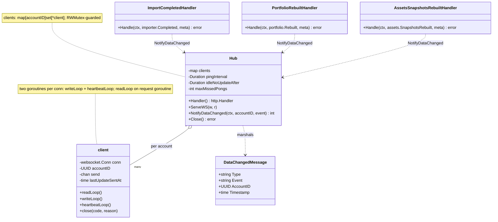
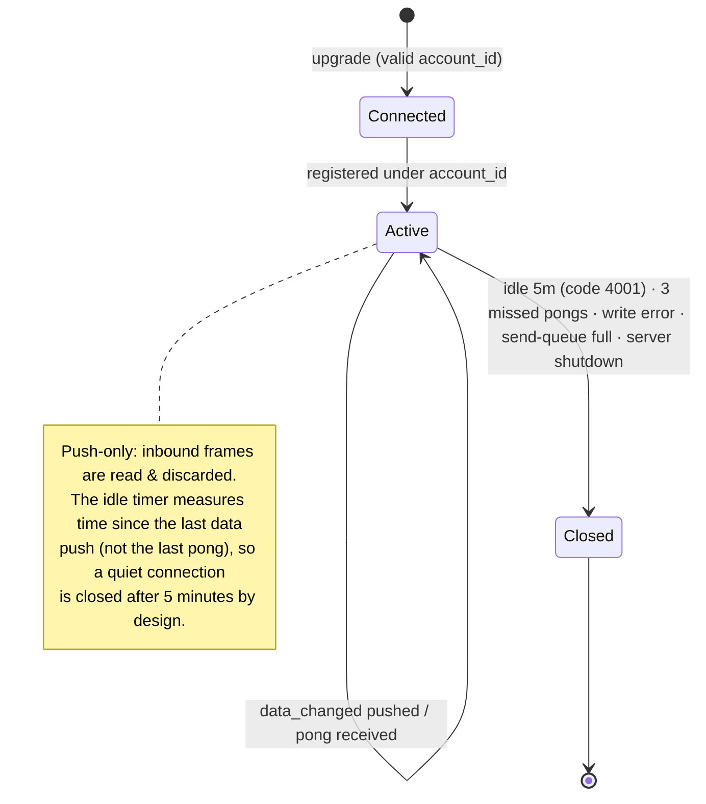
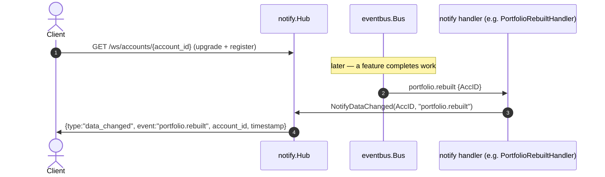

# [001] Realtime Updates (WebSocket)

> **Feature ID:** 001 · **Area:** Core (user-facing) · **Status:** refactored; not yet wired in a compiling entrypoint
>
> **Backend packages:** `internal/notify` · `transport/http/handlers/websocket.go` (Swagger stub) · `transport/http` (writer hijack + APM exclusion)
>
> **Related features:** [002] CSV imports · [013] Portfolio · [024] Assets · [017] Event-driven messaging

## Overview

Clients open an account-scoped WebSocket at `GET /ws/accounts/{account_id}`. The server
upgrades and registers the connection under that account. When backend work finishes for the
account, the server pushes a JSON `data_changed` message naming the event, so the UI can
refresh without polling. The protocol is **push-only** — inbound client frames are read and
discarded. Three completion events drive pushes:

| Bus topic (consumed) | Client event pushed |
| --- | --- |
| `import.completed` | `import.completed` |
| `portfolio.rebuilt` | `portfolio.rebuilt` |
| `assets.snapshots.rebuilt` | `assets.rebuilt` |

## Domain model

`DataChangedMessage.Type` is always `"data_changed"`; `Event` is one of the three client
event names above.

## Connection lifecycle

Close reasons are string labels (`idle_no_updates` with code `4001`, `pong_timeout`,
`write_failed`, `send_queue_full`, `server_shutdown`). An invalid `account_id` is rejected at
upgrade with `400`.

## Push flow

`NotifyDataChanged` marshals once and enqueues to every client registered for the account; a
client whose send queue is full is force-closed (`send_queue_full`). Import events with no
account (`AccountID == nil`, e.g. EOD imports) are dropped.

## Endpoint & middleware

| Method + route | Behavior |
| --- | --- |
| `GET /ws/accounts/{account_id}` | upgrade to WebSocket; register client under the path's account |

- The Swagger annotation lives on a doc-only stub (`WebSocketAccountUpdatesDoc`); the live
  handler is `Hub.Handler()`.
- The WebSocket upgrade survives the request-logging middleware because the custom
  `responseWriter` implements `Hijack()`/`Flush()`/`Push()` passthrough.
- WebSocket requests are **excluded from APM** transactions (`shouldIgnoreAPMServerRequest`).

## Events

All three handlers are typed `eventbus.Handler[T]`s that forward to `Hub.NotifyDataChanged`:

| Handler | Topic | Account extraction |
| --- | --- | --- |
| `ImportCompletedHandler` | `import.completed` | `*evt.AccountID` (skipped if nil) |
| `PortfolioRebuiltHandler` | `portfolio.rebuilt` | `evt.AccID` |
| `AssetsSnapshotsRebuiltHandler` | `assets.snapshots.rebuilt` | `evt.AccID` |

A single portfolio rebuild can fan out to both a `portfolio.rebuilt` and a later
`assets.rebuilt` push for the same account (the assets feature re-syncs on `portfolio.rebuilt`,
then publishes `assets.snapshots.rebuilt`). See [017].

## Code map

| Path | Responsibility |
| --- | --- |
| `internal/notify/hub.go` | `Hub`, `client`, `DataChangedMessage`, upgrade/serve, broadcast, ping/idle heartbeat, close/shutdown |
| `internal/notify/handlers.go` | Event-name constants + the three bus→websocket bridge handlers |
| `transport/http/handlers/websocket.go` | Swagger-only doc stub for the route |
| `transport/http/writer.go` | `responseWriter` with `Hijack`/`Flush`/`Push` (enables the upgrade through middleware) |
| `transport/http/server.go` | APM exclusion for the handshake; graceful shutdown |

## Refactor state / not implemented

- **No authentication / authorization.** The route has no auth and no ownership check — any
  caller who knows an `account_id` UUID can subscribe; `CheckOrigin` defaults to accept-all.
- **No inbound protocol / no replay.** Messages are fire-and-forget into a bounded per-client
  queue; nothing is buffered or redelivered across reconnects, and idle connections are closed
  after 5 minutes (clients must reconnect).
- Subscriptions are only wired in the stale `cmd/server/main.go` (via a removed bus API); the
  handler signatures already fit `eventbus.Subscribe[T]` but no new entrypoint calls it yet.
