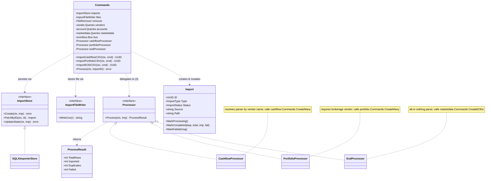
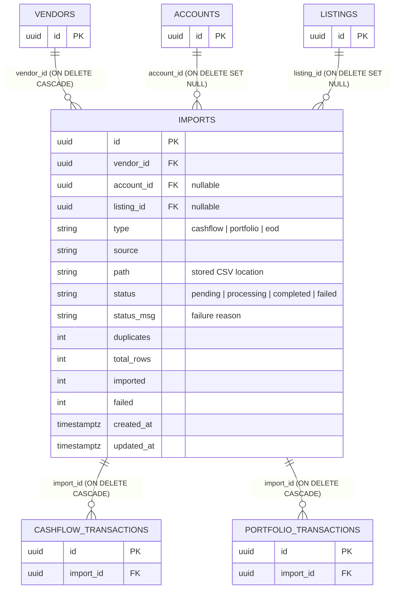
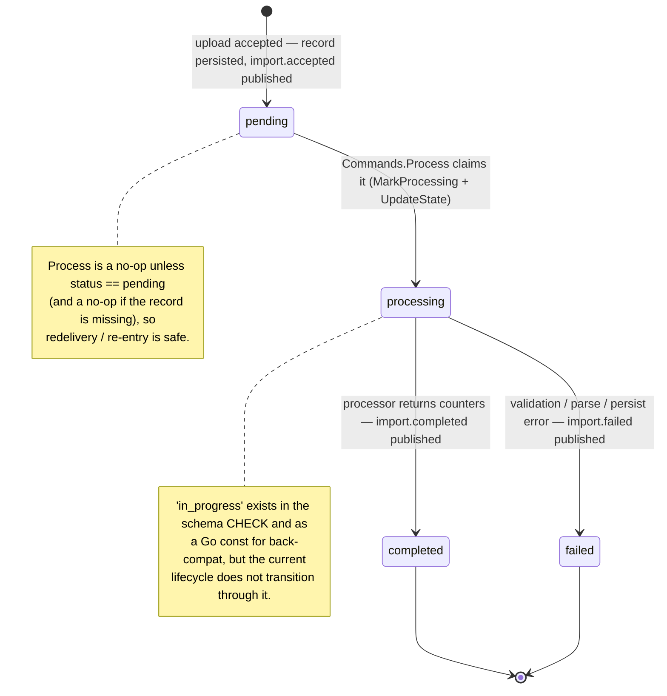
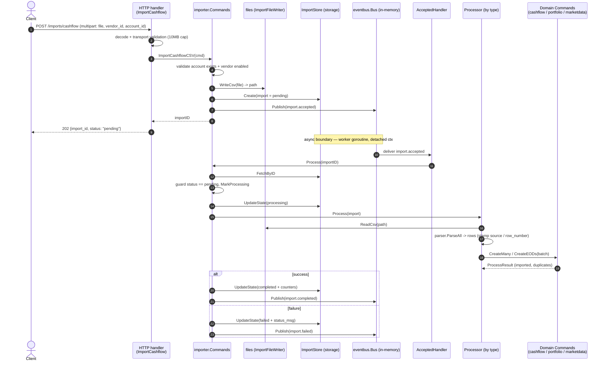

# [002] CSV Imports

> **Feature ID:** 002 · **Area:** Core (user-facing) · **Status:** implemented (composition wiring is mid-refactor)
>
> **Backend packages:** `internal/importer` · `transport/http/handlers/importer` · `transport/messaging/handlers/importer` · `internal/storage/sqlx_importer_store.go`
>
> **Related features:** [001] Realtime updates (WebSocket) · [009] Cashflow · [013]–[015] Portfolio · [007]–[008] EOD market data · [017] Event-driven messaging

## Overview

CSV imports let a user upload a vendor file and have it ingested **asynchronously**:
the upload request validates the input, stores the raw file durably, records a
`pending` import, and returns immediately with an import ID. A bus subscriber then
parses and persists the rows on a background worker, advancing the import through its
lifecycle and publishing a completion (or failure) event.

There are three **explicit** import types — the user picks one by choosing the matching
endpoint; the system never infers the type from the file contents:

| Type | Endpoint | Required inputs | `source` stamped | Parser resolved by | Target domain |
| --- | --- | --- | --- | --- | --- |
| **Cashflow** | `POST /imports/cashflow` | `file`, `vendor_id`, `account_id` | vendor name | vendor name (`ING`, `DEGIRO`, `N26`) | `cashflow.Commands.CreateMany` |
| **Portfolio** | `POST /imports/portfolio` | `file`, `vendor_id`, `account_id` | vendor name | vendor name (`DEGIRO`) | `portfolio.Commands.CreateMany` |
| **EOD** | `POST /imports/eod` | `file`, `listing_id` | listing source | listing source (`brandnewday`) | `marketdata.Commands.CreateEODs` |

The upload is **commit-and-process**: there is no preview, staging, or approval step,
and there is currently no read/status endpoint to poll an import (see
[Out of scope](#out-of-scope--not-implemented)). Uploads are capped at 10 MB.

## Domain model

The write side is a single `Commands` type that owns acceptance and orchestration, and
delegates type-specific parsing/persistence to a `Processor`. Storage and the three
processors plug in behind small feature-owned interfaces.

A processor never owns final persistence policy: it parses the file into a batch and
hands the **whole batch** to the relevant feature's `Commands`, which apply that
feature's own deduplication (cashflow/portfolio use a unique row `checksum`) and any
rebuild behavior. The importer is the orchestrator; the feature stays authoritative.

## Data model

The durable record is `import.imports` (physical name `import.imports` on Postgres,
flattened to `import_imports` on SQLite via `qualifyTable`). Deleting an import cascades
to the cashflow / portfolio transactions it produced.

Indexes: `idx_imports_status_created (status, created_at)` (oldest-pending-first queue
ordering) and `idx_imports_vendor_id`.

> **Refactor note.** Cashflow/portfolio imports set `vendor_id`; EOD imports are
> listing-scoped and set `listing_id` + `source` only. The schema still declares
> `vendor_id NOT NULL` with an FK to `vendor.vendors`, which is a tension to resolve as
> the refactor lands — the `type`/`source`/`listing_id` columns are likewise modelled
> ahead of fully-settled wiring (see `CHANGELOG` [002]/[019]).

## Import lifecycle

| Status | Meaning |
| --- | --- |
| `pending` | File stored and record created; waiting for a worker. |
| `processing` | A worker has claimed the import and is parsing/persisting. |
| `completed` | The target feature accepted the batch; result counters are stored. |
| `failed` | Validation, parsing, or persistence failed; `status_msg` holds the reason. |
| `in_progress` | Legacy/compat status — present in the schema + Go const, unused by the lifecycle. |

There is no `cancelled` and no `completed_with_errors` — for cashflow/portfolio a
downstream failure fails the whole import; for EOD any row error fails the whole import.

## End-to-end flow

The upload returns `202 Accepted` as soon as the file and record are durable. Processing
happens later on an in-memory bus worker goroutine with a **detached context**.

`import.completed` fans out to other features (e.g. portfolio rebuild and the realtime
WebSocket notification) — those reactions live in [017] / [001], not in this feature.

## Processing rules

All three processors share the shape *resolve parser → read file → `ParseAll` → hand
the batch to the feature → return a `ProcessResult`*, but differ in their inputs and
failure semantics:

- **Cashflow** — requires `account_id`; resolves the parser by vendor name; stamps each
  row with the vendor `source` and its CSV `row_number`; calls `cashflow.Commands.CreateMany`.
  An empty file is a no-op success.
- **Portfolio** — requires `account_id` **and** a brokerage vendor (re-checked in the
  processor, not just at accept time); stamps `row_number`; calls
  `portfolio.Commands.CreateMany`.
- **EOD** — requires `listing_id`; resolves the parser by listing source; parsing is
  **all-or-nothing**: if the parser reports any row errors the import fails (reporting
  `TotalRows` and `Failed`) without persisting anything; otherwise maps rows to
  `marketdata.EODInput` and calls `marketdata.Commands.CreateEODs`.

Result counters (`ProcessResult`) flow back into the import record: `TotalRows`,
`Imported`, `Duplicates`, `Failed`. On a downstream persistence error a processor returns
`TotalRows = len(batch)` and `Failed = len(batch)` so the failed record reflects the size.

## Validation & error mapping

Validation is split: **transport** checks shape (required form fields, file present,
size), **`Commands`** enforce domain rules. Known feature errors map to HTTP status:

| Condition | Domain error | HTTP status |
| --- | --- | --- |
| Missing file contents | `ErrImportFileRequired` | 400 |
| Missing `vendor_id` (cashflow/portfolio) | `ErrVendorIDRequired` | 400 |
| Missing / invalid `account_id` shape | (transport `isValid`) | 400 |
| Account does not exist | `ErrAccountNotExists` | 404 |
| Vendor not found | `vendor.ErrVendorNotFound` | 404 |
| Vendor import disabled | `ErrVendorImportDisabled` | 422 |
| Vendor not a brokerage (portfolio) | `ErrVendorNotBrokerage` | 422 |
| Listing not found (EOD) | `ErrImportListingNotFound` | 404 |
| Listing inactive / no usable provider / provider not manual (EOD) | `ErrImportListingInactive`, `ErrImportProviderUnavailable`, `ErrImportProviderNotManual` | 422 |
| Anything else | — | 500 |

If record creation fails after the file is written, `Commands` removes the stored file
via `FileRemover` so a rejected upload leaves no orphan.

## Events

The importer is both a publisher and (indirectly) the trigger for its own async work.

| Topic | Payload | Published when | Primary consumer |
| --- | --- | --- | --- |
| `import.accepted` | `Accepted{ImportID, Type}` | after the record is persisted | `AcceptedHandler` → `Commands.Process` |
| `import.completed` | `Completed{ImportID, Type, AccountID, ListingID}` | after `completed` | downstream features ([013], [001], [017]) |
| `import.failed` | `Failed{ImportID, Type, AccountID, ListingID, Reason}` | after `failed` | observability / future consumers |

`AcceptedHandler` exists specifically to replace the removed background import job:
without a subscriber on `import.accepted`, accepted uploads would stay `pending` forever.

## Code map

| Path | Responsibility |
| --- | --- |
| `internal/importer/import.go` | `Import` record, `ImportType`/`ImportStatus`, `Mark*` transitions, `NewTypedImport` |
| `internal/importer/commands.go` | Write side: `accept` (validate → store file → create → publish) and `Process` orchestration |
| `internal/importer/processor.go` | `Processor` interface, `ProcessResult`, parser-factory function types |
| `internal/importer/events.go` | Topic constants + `Accepted`/`Completed`/`Failed` payloads |
| `internal/importer/errors.go` | Feature-level errors |
| `internal/importer/{cashflow,portfolio,eod}/processor.go` | Type-specific parse + persist |
| `internal/importer/{cashflow,portfolio,eod}/parsers/` | Vendor/source parsers + resolution factory |
| `transport/http/handlers/importer/{cashflow,portfolio,eod}.go` | Multipart upload endpoints, request DTOs, error → status mapping |
| `transport/messaging/handlers/importer/accepted.go` | Bus subscriber that runs `Process` on `import.accepted` |
| `internal/storage/sqlx_importer_store.go` | SQL persistence (`Create` / `FetchByID` / `UpdateState`) |
| `migrations/{postgres,sqlite}/*_init.sql` | `import.imports` table, FKs, and queue index |

## Out of scope / not implemented

- **Import read/status API** — no endpoint to fetch an import or poll its progress; the
  202 response returns only the ID and `pending`.
- **Preview / staging / approval** — uploads commit immediately.
- **Cancellation** — there is no `cancelled` state.
- **Deduplication policy** — owned by the target feature (`checksum`), not the importer.
- **Portfolio rebuild & realtime notifications** — reactions to `import.completed` live in
  [013] / [001] / [017].
