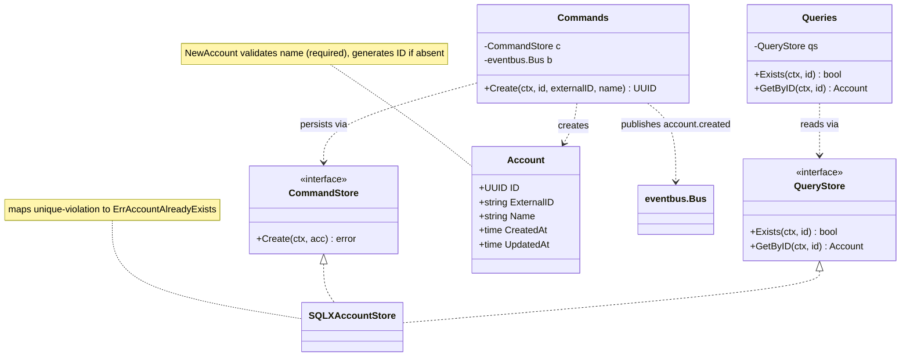
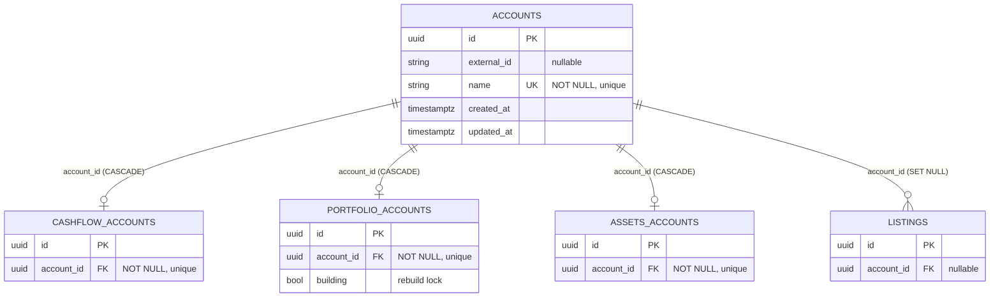
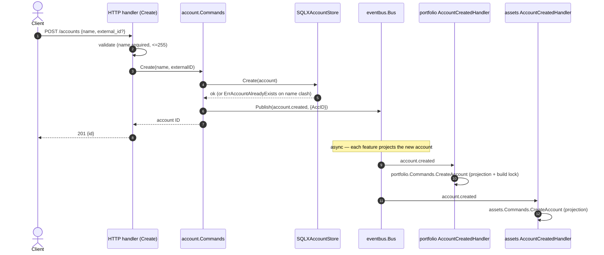

# [003] Account Management

> **Feature ID:** 003 · **Area:** Core (user-facing) · **Status:** refactored; not yet wired in a compiling entrypoint
>
> **Backend packages:** `internal/account` · `transport/http/handlers/account` · `transport/messaging/handlers/{portfolio,assets}` · `internal/storage/sqlx_account_store.go`
>
> **Related features:** [002] CSV imports · [009] Cashflow · [013] Portfolio · [024] Assets · [017] Event-driven messaging

## Overview

The `account` aggregate is the canonical scope every other feature hangs off. An account
is a named entity with an optional external identity (e.g. Google / Entra ID); cashflow,
portfolio, assets, and importer all reference it by ID. The feature is deliberately small:

- **Write:** create an account (`POST /accounts`).
- **Read:** look one up / test existence (`Exists`, `GetByID`) — consumed by other features
  as a collaborator, not (currently) exposed as a list endpoint.

Account creation is the system's central **fan-out trigger**: it publishes `account.created`,
and each feature creates its own per-account projection row in response (see [Events](#events)).

## Domain model

## Data model

`account.accounts` is a root table (no FKs). It is referenced 1:1 by each feature's
per-account projection, all of which cascade-delete with the account.

Physical names: Postgres `account.accounts`; SQLite flattens to `accounts`. Uniqueness is
enforced on **`name`** (not `external_id`). There is no status column — an account has no
lifecycle/state machine.

## Create + fan-out flow

## Validation & error mapping

| Condition | Error | HTTP status |
| --- | --- | --- |
| Empty/whitespace name | `ErrAccountNameRequired` (domain) / transport `isValid` | 400 |
| Name > 255 chars | transport `isValid` | 400 |
| Name already taken | `ErrAccountAlreadyExists` (unique violation on `name`) | 409 |
| Anything else | — | 500 |

`external_id` is free-form and optional; it is not format-validated and not unique.

## Events

| Topic | Constant | Payload | Published when | Consumers (current code) |
| --- | --- | --- | --- | --- |
| `account.created` | `account.TopicCreated` | `Created{AccID uuid.UUID}` | after a successful insert | portfolio projection, assets projection |

**Intended vs. implemented fan-out.** `FEATURES.md` describes the fan-out reaching
portfolio, cashflow, assets, **and** importer. In the refactored tree only **portfolio**
and **assets** `account.created` handlers exist; the `cashflow.accounts` projection table
exists but nothing populates it yet, and the importer has no account-projection handler in
the new structure. See [Refactor state](#refactor-state).

## Code map

| Path | Responsibility |
| --- | --- |
| `internal/account/account.go` | `Account` aggregate + `NewAccount` validation |
| `internal/account/commands.go` | `Commands.Create` (publishes `account.created`) + `CommandStore` |
| `internal/account/queries.go` | `Queries.Exists`/`GetByID` + `QueryStore` |
| `internal/account/events.go` | `TopicCreated` + `Created` payload |
| `internal/account/errors.go` | `ErrAccountNotFound` / `ErrAccountAlreadyExists` / `ErrAccountNameRequired` |
| `transport/http/handlers/account/create.go` | `POST /accounts` handler + DTOs + error mapping |
| `internal/storage/sqlx_account_store.go` | `SQLXAccountStore` implementing both store interfaces |
| `internal/bootstrap/accounts.go` | Seeds a default account on startup through `account.Commands`/`account.Queries` |
| `transport/messaging/handlers/{portfolio,assets}/account_created.go` | Projection subscribers |

## Refactor state

- `account.NewCommands` now exposes the write side for composition, but no compiling entrypoint
  currently serves `POST /accounts`.
- **Bootstrap seeding** goes through `account.Commands` and follows its event behavior when it
  creates the default account.
- **Not implemented:** update/delete/list account operations; a `GET /accounts` read endpoint;
  cashflow and importer `account.created` projections.
