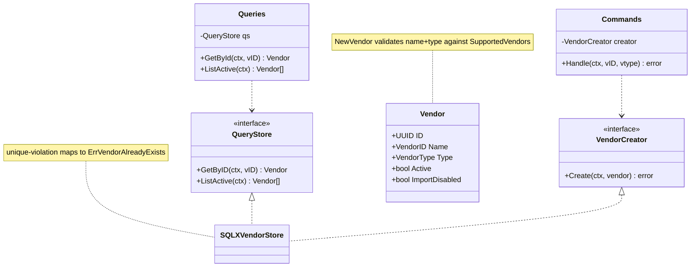
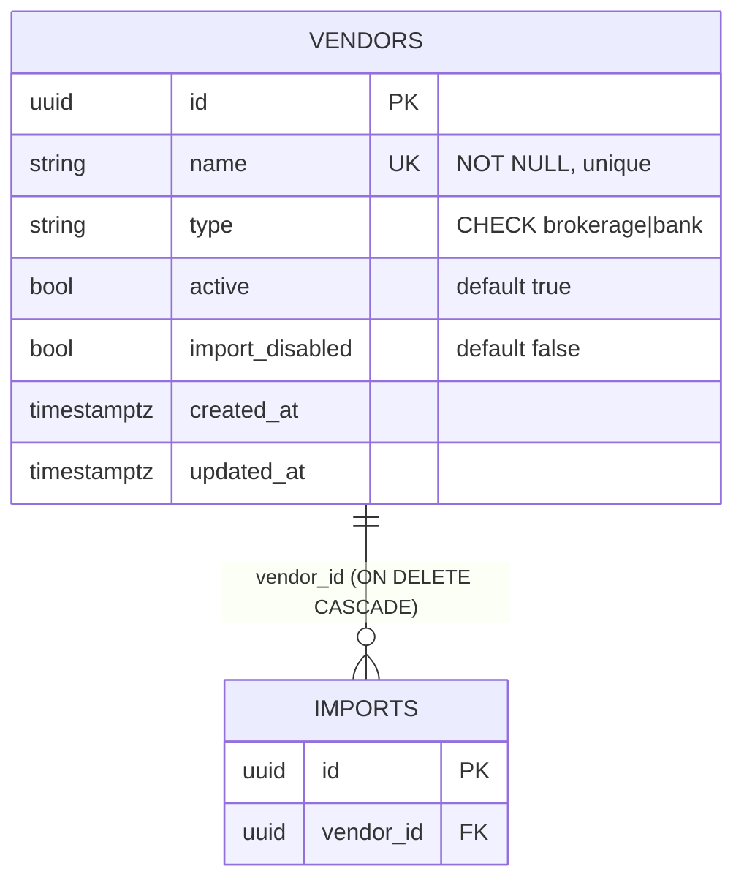
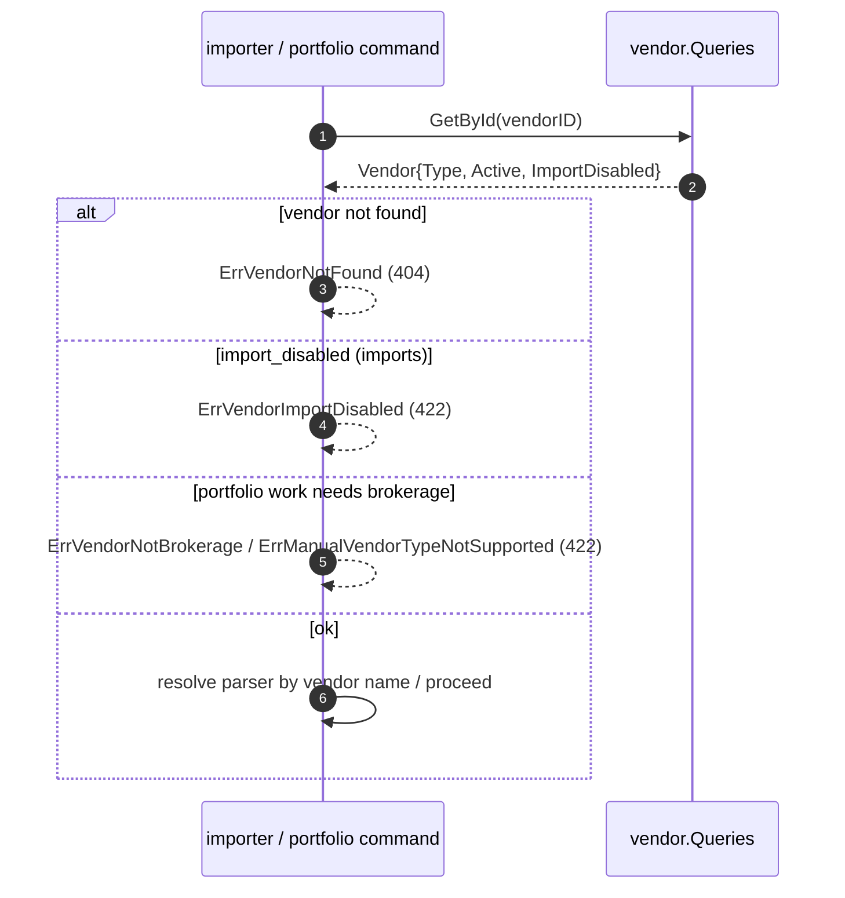

# [004] Vendor Listing

> **Feature ID:** 004 · **Area:** Market data & admin · **Status:** refactored; not yet wired in a compiling entrypoint
>
> **Backend packages:** `internal/vendor` · `transport/http/handlers/vendors` · `internal/storage/sqlx_vendor_store.go` · `internal/bootstrap/vendors.go`
>
> **Related features:** [002] CSV imports · [013] Portfolio (manual transactions)

## Overview

Vendors are the supported financial-data sources for imports (ING, DeGiro, N26,
BrandNewDay). The feature seeds a fixed allow-list at startup and exposes a single read
endpoint (`GET /vendors`) returning the **active** vendors with capability metadata so the
UI can present import targets and enforce vendor-level rules. Vendors are **immutable** from
the API — there is no create/update/delete endpoint; the only writer is bootstrap seeding.

The capability metadata (`type`, `active`, `import_disabled`) gates downstream flows: the
importer rejects import-disabled vendors, and both the importer and portfolio manual-create
require a **brokerage** vendor for portfolio work.

## Domain model

`VendorType` ∈ {`brokerage`, `bank`}. The supported set (`SupportedVendors`): `ING` (bank),
`DEGIRO` (brokerage), `N26` (bank), `BrandNewDay` (brokerage). All are seeded active and
import-enabled.

## Data model

Physical names: Postgres `vendor.vendors`; SQLite `vendors`. Index `idx_vendors_active_name (active, name)`
serves the `ListActive` query (filter active, order by name).

## Vendor gating across features

There is no inbound vendor lifecycle to model (vendors are seeded and immutable). The
interesting behavior is how the capability metadata gates other features:

Brokerage gating is enforced in three places: importer accept (`ImportPortfolioCSV`), the
importer portfolio processor (defense-in-depth at process time), and portfolio manual create.
Cashflow imports accept both bank and brokerage vendors.

## Endpoint

| Method + route | Inputs | Response |
| --- | --- | --- |
| `GET /vendors` | none | `200 [{id, name, type, active, import_disabled, created_at, updated_at}]` |

Only active vendors are listed; any store error → 500. There is no `GET /vendors/{id}`
(though `Queries.GetById` exists for internal use).

## Events

None. The `vendor` package publishes and consumes no events.

## Code map

| Path | Responsibility |
| --- | --- |
| `internal/vendor/vendor.go` | `Vendor`, `VendorID`/`VendorType` + constants, `SupportedVendors`, `NewVendor`, errors, interfaces |
| `internal/vendor/queries.go` | `Queries.GetById`/`ListActive` + `QueryStore` |
| `internal/vendor/commands.go` | `Commands.Handle` (create) + `VendorCreator` |
| `internal/storage/sqlx_vendor_store.go` | `SQLXVendorStore` (`Create`/`GetByID`/`ListActive`) |
| `internal/bootstrap/vendors.go` | Idempotent startup seeding of `SupportedVendors` |
| `transport/http/handlers/vendors/vendors.go` | `GET /vendors` handler + `VendorResponse` |

## Refactor state / not implemented

- **No vendor management API** — vendors are a hard-coded allow-list, seeded only; `active`
  / `import_disabled` cannot be toggled without a direct DB write.
- A duplicate legacy `CreateHandler` (`internal/vendor/create.go`) still exists alongside the
  newer `Commands`; bootstrap uses `Commands`. The `ActiveVendorLister` interface is
  effectively dead aside from a `var _` assertion.
- The `GET /vendors` route is only registered in the stale `cmd/server/main.go` (against an
  older `handlers.GetVendors`); the new `vendors.List` handler is not yet wired.
