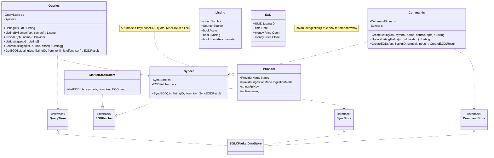
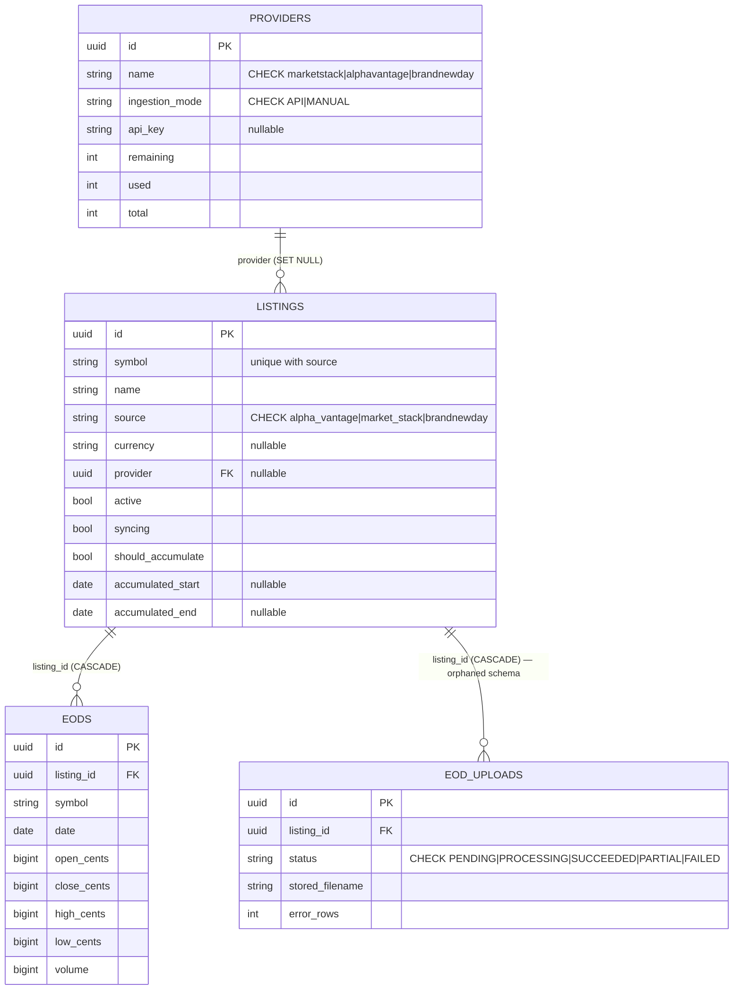
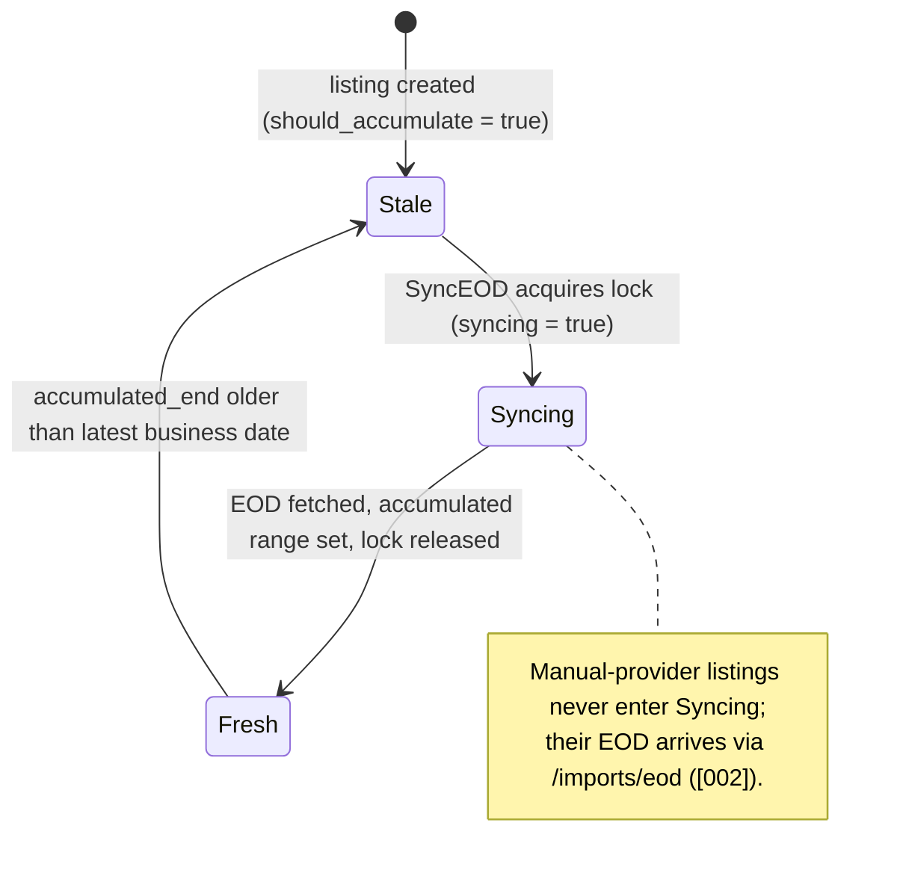
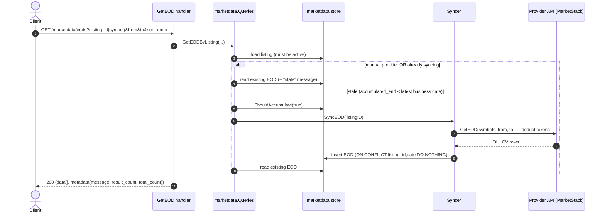

# [005]–[008] Market Data

> **Feature IDs:** 005 (provider support) · 006 (listing management) · 007 (EOD retrieval) · 008 (manual EOD uploads) · **Area:** Market data & admin · **Status:** refactored; not yet wired in a compiling entrypoint
>
> **Backend packages:** `internal/marketdata` (+ `marketstack`) · `transport/http/handlers/marketdata` · `internal/storage/sqlx_marketdata_store.go` · `internal/bootstrap/providers.go`
>
> **Related features:** [002] CSV imports (manual EOD upload path) · [013] Portfolio (consumes listings + EOD) · [004] Vendors

## Overview

Market data owns the canonical instruments (**listings**) and their **end-of-day** price
history, backed by pluggable **providers**:

- **[005] Providers** — two ingestion modes: `API` (MarketStack, Alpha Vantage) and `MANUAL`
  (BrandNewDay). API keys come from env only and a provider may hold several keys (token
  quota tracked per key). The mode controls whether a listing auto-syncs and whether manual
  EOD uploads are allowed.
- **[006] Listings** — create, partial update (PATCH), list all, and search with pagination.
- **[007] EOD retrieval** — `GET /marketdata/eods` filters by listing or symbol, with a
  date range, pagination, and sort order; for API listings it lazily triggers a sync when the
  data is stale.
- **[008] Manual EOD uploads** — a manual EOD CSV is uploaded via the **importer**
  (`POST /imports/eod`, see [002]); the dedicated upload-record + status-polling API is **not
  implemented** (see [Refactor state](#refactor-state--not-implemented)).

## Domain model

Enums: `Source` ∈ {`alpha_vantage`, `market_stack`, `brandnewday`}; `ProviderIngestionMode` ∈
{`API`, `MANUAL`}; `ProviderName` ∈ {`marketstack`, `alphavantage`, `brandnewday`}.

## Data model

Key points: `listings` is unique on `(symbol, source)`; `eods` (the EOD table, physical
name `marketdata.eods` / `eods`) is unique on `(listing_id, date)` and dedups via
`ON CONFLICT … DO NOTHING`; `providers` has **no** unique constraint on `name` (multiple API
keys = multiple rows). The `eod_uploads` table exists in both migrations but **no Go code
references it** — it is orphaned schema from the not-yet-rebuilt [008] flow. Listings are
**global** (not account-scoped).

## Listing sync lifecycle

API-backed listings accumulate EOD data lazily; manual listings never sync.

## EOD retrieval flow

## Endpoints

| Feature | Method + route | Key inputs | Success |
| --- | --- | --- | --- |
| [006] Create listing | `POST /marketdata/listing` | body: `name`, `symbol`, `source`, optional `description/exchange/region/currency/isin/ticker/type` | 201 listing |
| [006] Update listing | `PATCH /marketdata/listing` | body: `id` + ≥1 optional field | 200 listing |
| [006] List listings | `GET /marketdata/listings` | none | 200 `[listing]` |
| [006] Search listings | `GET /marketdata/listings/search` | query: `q`, `limit` (≤100), `offset` | 200 `{pagination, data[]}` |
| [007] Get EOD | `GET /marketdata/eods` | query: `listing_id`\|`symbol`, `from`, `to`, `limit`, `offset`, `sort_order` | 200 `{data[], metadata}` |
| [008] Upload manual EOD | `POST /imports/eod` (importer, see [002]) | multipart: `file`, `listing_id` | 202 `{import_id, status}` |

**Error mapping (highlights):** create `ErrListingAlreadyExists` → 409; validation (empty
name/symbol/source, invalid currency) → 400; update `ErrListingNotFound` → 404,
`ErrNoListingFieldsToUpdate` → 400; EOD `ErrListingNotFound` → 404, bad date range → 400;
else 500.

## Processing rules

- **Provider mode gates everything.** `CreateListing` only triggers a sync for non-manual
  sources. `GetEODByListing` skips sync for manual providers or in-flight syncs and otherwise
  triggers one when data is stale. Manual EOD uploads require both `Source.IsManualIngestion()`
  and `Provider.IsManualIngestion()` (BrandNewDay + a `MANUAL` provider).
- **Listing search** is a case-insensitive `LIKE` over symbol/name/ISIN with a server-clamped
  limit (≤100, default 25), ordered `symbol, id` (fixed — not configurable).
- **EOD retrieval** uses `internal/sorting` for the `date` sort order; pagination is offset-based.
- **Token quota.** The store ranks provider keys (manual first, then non-exhausted by
  remaining/used) and deducts tokens per fetch (ceiling division by page size).
- **Dedup.** EOD is deduped at the unique `(listing_id, date)` constraint; `Imported` =
  rows inserted, `Duplicates` = the remainder.

## Events

The `marketdata` package publishes/consumes no events directly. Manual EOD ingestion rides
the importer's event flow (`import.accepted` → process → `import.completed`/`failed`); see [002].

## Code map

| Path | Responsibility |
| --- | --- |
| `internal/marketdata/listing.go` | `Listing`, `Source` + `IsManualIngestion`, `NewListing` + options |
| `internal/marketdata/eod.go` | `EOD` OHLCV + `NewEOD` |
| `internal/marketdata/provider.go` | `Provider`, ingestion-mode/name enums, `ProviderNameFromSource`, `Validate` |
| `internal/marketdata/commands.go` · `queries.go` · `syncer.go` | write/read sides + sync engine + their interfaces |
| `internal/marketdata/marketstack/client.go` | `MarketStackClient` (paginated `GetEOD` + token deduction) |
| `transport/http/handlers/marketdata/{listings,eod}.go` | Listing + EOD handlers + DTOs |
| `internal/storage/sqlx_marketdata_store.go` | `SQLXMarketDataStore` (listings/providers/EOD) |
| `internal/bootstrap/providers.go` | Seeds API providers (per key) + the manual provider |

## Refactor state / not implemented

- **[008] EOD-upload records + status polling are not implemented.** There is no
  `DailyUpload` type, store, handler, or `GET …/uploads/{id}` endpoint; the `eod_uploads`
  table and its indexes are orphaned schema. Manual EOD goes through the generic import
  lifecycle ([002]); per-row errors are counted but not persisted, and any row error fails the
  whole import.
- **API-provider auto-sync is currently non-functional.** `Syncer.SyncEOD` has a nil-result
  bug (panics when the fetch loop runs) and is single-threaded (`TODO: worker pool`). Only the
  MarketStack fetcher exists (no Alpha Vantage `EODFetcher`).
- **No provider CRUD API** (providers are bootstrap-only) and **no admin/role middleware** —
  the "admin" framing in `FEATURES.md` is not enforced in code.
- `marketdata.Commands` has a startup constructor for provider bootstrap, but `Queries` and
  `Syncer` do not yet have complete startup constructors, and routes are only wired in the
  stale `cmd/server/main.go`.
