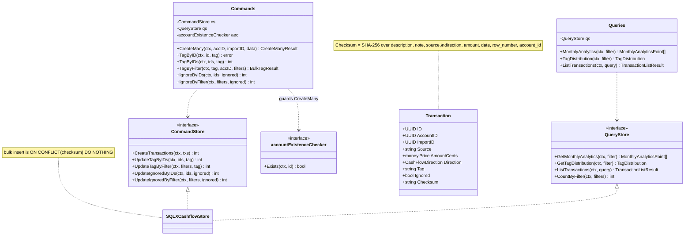
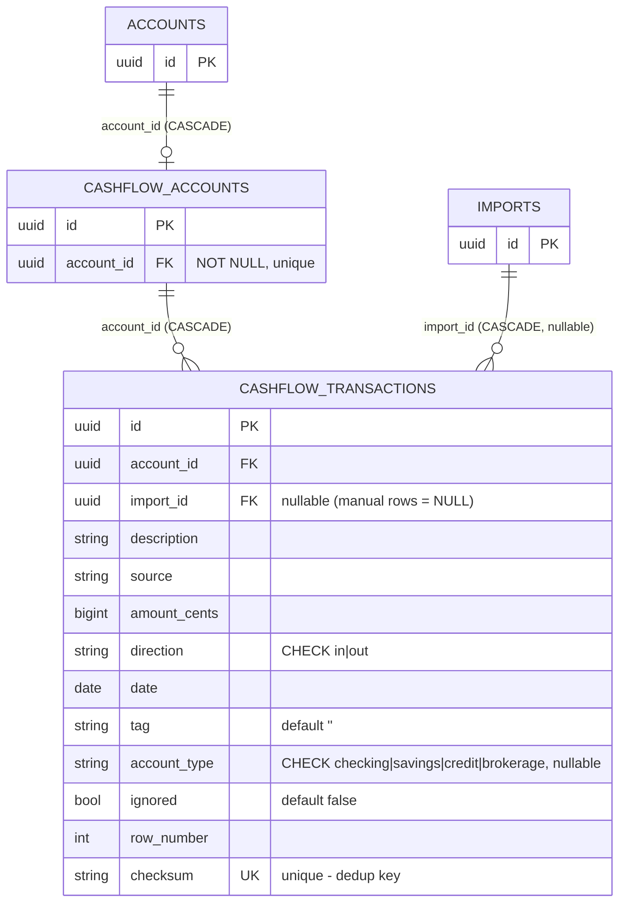
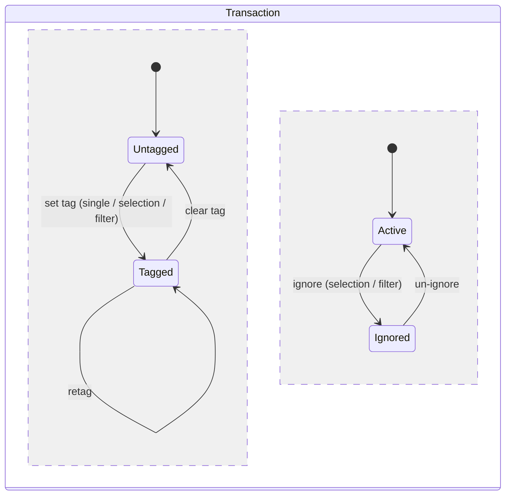
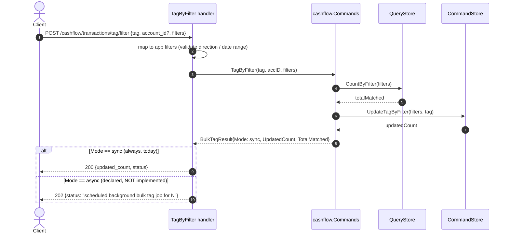

# [009]–[012],[023] Cashflow

> **Feature IDs:** 009 (querying) · 010 (analytics) · 011 (tagging) · 012 (ignore) · 023 (manual transactions) · **Area:** Core (user-facing) · **Status:** refactored; not yet wired in a compiling entrypoint
>
> **Backend packages:** `internal/cashflow` · `transport/http/handlers/cashflow` · `internal/storage/sqlx_cashflow_store.go` · `internal/importer/cashflow`
>
> **Related features:** [002] CSV imports · [003] Account management · [010] shares the same store

## Overview

Cashflow is the bank/payment transaction subsystem. Transactions arrive two ways — bulk
from a CSV import ([002]) or manually entered — and are then queried, analyzed, tagged, and
ignored:

- **[009] Query** — list transactions with field filters (description/note/source contains,
  direction, tags, untagged), a fuzzy `q`, `hide_ignored`, date range, sorting, and offset
  pagination.
- **[010] Analytics** — monthly incoming/outgoing/net trends, and tag distribution
  (combined / incoming / outgoing). Both accept a date range and `include_ignored`.
- **[011] Tagging** — tag a single transaction, a selection of IDs, or everything matching a
  filter.
- **[012] Ignore** — mark a selection or a filter match as ignored / not-ignored; ignored
  rows drop out of analytics totals.
- **[023] Manual create** — bulk-create up to 100 manual transactions for an account.

## Domain model

Enums: `CashFlowDirection` ∈ {`in`, `out`}; `AccountType` ∈ {`checking`, `savings`,
`credit`, `brokerage`}. Manual rows carry `source = "manual"` or `"manual:<vendor>"`;
imported rows carry the vendor name.

## Data model

Physical names: Postgres `cashflow.transactions` / `cashflow.accounts`; SQLite `transactions`
/ `cashflow_accounts`. A partial analytics index covers `(date, direction, tag) WHERE ignored = FALSE`.
Note `cashflow.transactions.account_id` references the projection (`cashflow.accounts.account_id`),
not `account.accounts` directly.

## Transaction classification states

`tag` and `ignored` are independent classifications a transaction moves through after it
exists:

Ignored transactions are excluded from analytics totals unless the request sets
`include_ignored`.

## Filter-based tagging flow

The filter-based tag/ignore commands are the only ones with a (declared) sync-vs-async
decision. Today the command always runs synchronously.

## Endpoints

| Capability | Method + route | Key inputs | Success |
| --- | --- | --- | --- |
| [009] Query | `GET /cashflow/transactions` | query: `limit/offset`, `sort_by/sort_order`, `q`, `description/note/source`, `direction`, `tags`, `untagged`, `hide_ignored`, `from/to` | 200 `{pagination, data[]}` |
| [023] Manual create | `POST /cashflow/transactions/manual` | body: `account_id`, `transactions[]` (`date`, `amount`, `type`, `description`, `note`, `tag`, `vendor?`) | 201 `{created_count, data[]}` |
| [010] Monthly | `GET /cashflow/analytics/monthly` | query: `from`, `to`, `include_ignored` | 200 `{data[]}` |
| [010] Tag distribution | `GET /cashflow/analytics/tags` | query: `from`, `to`, `include_ignored` | 200 `{combined, incoming, outgoing}` |
| [011] Tag one | `POST /cashflow/transactions/tag` | body: `id`, `tag` | 200 |
| [011] Tag selection | `POST /cashflow/transactions/tag/selection` | body: `tag`, `ids[]` | 200 `{updated_count, status}` |
| [011] Tag filter | `POST /cashflow/transactions/tag/filter` | body: `tag`, `account_id?`, `filters` | 200 (sync) / 202 (async, dead) |
| [012] Ignore selection | `POST /cashflow/transactions/ignore/selection` | body: `ignored?` (default true), `ids[]` | 200 `{updated_count, status}` |
| [012] Ignore filter | `POST /cashflow/transactions/ignore/filter` | body: `ignored?`, `filters` | 200 |

**Error mapping (common):** decode / validation / `ParseDirection` / bad sort / bad date range
→ 400; manual create `ErrAccountNotFound` → 404; manual create with any duplicate → 409; store
errors → 500. Tagging a non-existent ID returns 200 (zero rows updated).

## Processing rules

- **Dedup.** `NewTransaction` computes a SHA-256 `checksum` over description, note, source,
  direction, amount-cents, date (`YYYYMMDD`), `row_number`, and account ID. Bulk inserts use
  `ON CONFLICT (checksum) DO NOTHING`; `Imported` = rows actually inserted, `Duplicates` =
  the remainder. Because `row_number` is in the checksum, the same logical transaction on a
  different CSV row counts as distinct.
- **Manual create.** Capped at 100 rows (`ErrTransactionLimitExceeded`); `tag` is required;
  `source` = `manual` or `manual:<vendor>`; any duplicate in the batch yields a 409.
- **Filtering.** `description`/`note`/`source` use case-insensitive `LIKE %v%`; `direction`
  exact; `tags` OR-matched; `untagged` = empty tag; `hide_ignored` = `ignored = false`; `from`/`to`
  bound `date`; `q` fuzzy-matches description/note/tag. Conditions are AND-joined.
- **Sorting/pagination.** Uses `internal/sorting`; sortable fields are `date` (default, DESC),
  `description`, `note`, `tag`, `source`, `amount`. Offset pagination with default limit 100.
- **Analytics.** Monthly buckets by month (`DATE_TRUNC` / `STRFTIME`) summing in/out and
  `net = incoming − outgoing`. Tag distribution groups by tag (untagged → `"untagged"`) split
  by direction, ordered by total desc. Both exclude `ignored` unless `include_ignored`.

## Events

Cashflow publishes **no** events. Imported rows are written synchronously inside the importer's
cashflow processor (which calls `Commands.CreateMany` with the import ID); cashflow does not
subscribe to `import.completed`.

## Code map

| Path | Responsibility |
| --- | --- |
| `internal/cashflow/commands.go` | Write side: `CreateMany`, tag/ignore commands, `CommandStore`, bulk-tag result/mode |
| `internal/cashflow/queries.go` | Read side: list + analytics, `QueryStore`, sort fields, `ParseTransactionSort` |
| `internal/cashflow/filters.go` | App-level `TransactionFilters` for bulk mutations |
| `internal/cashflow/transaction.go` | `Transaction`, checksum, `CashFlowDirection`/`AccountType`, `CsvParser` |
| `internal/cashflow/errors.go` | Manual-create + account errors |
| `transport/http/handlers/cashflow/*.go` | Query, manual create, analytics, tag (×3), ignore (×2) handlers + DTOs |
| `internal/storage/sqlx_cashflow_store.go` | `SQLXCashflowStore` (both interfaces): inserts, list/count, tag/ignore, analytics SQL |
| `internal/importer/cashflow/` | Import processor + vendor CSV parsers (ING / DeGiro / N26) |

## Refactor state / not implemented

- **Async bulk tagging is not implemented.** `TagByFilter`/`IgnoreByFilter` always run
  synchronously and return `Mode: sync`; the HTTP 202 branch and `TagByFilterModeAsync` are
  currently dead. The old `[022]` auto-tagging agent (`TaggerJob`, `agent.enabled`) was
  removed with the `internal/jobs` package; `internal/cashflow/auto_tagger.go` remains as
  orphaned scaffolding with no caller.
- **No cashflow account projection wiring.** `cashflow.accounts` exists in the schema but no
  `account.created` handler or cashflow-account store populates it in the refactored tree.
- The new entrypoint does not yet register cashflow routes (only the stale `cmd/server/main.go` did).
