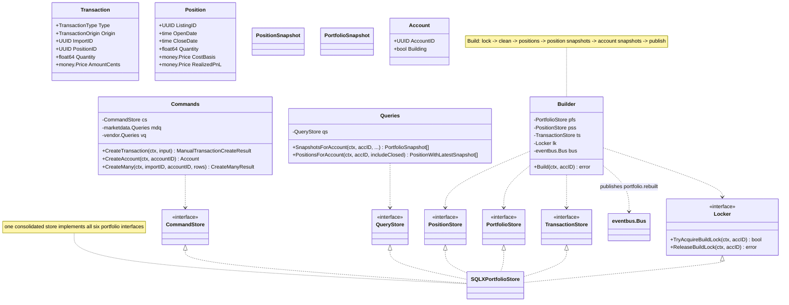
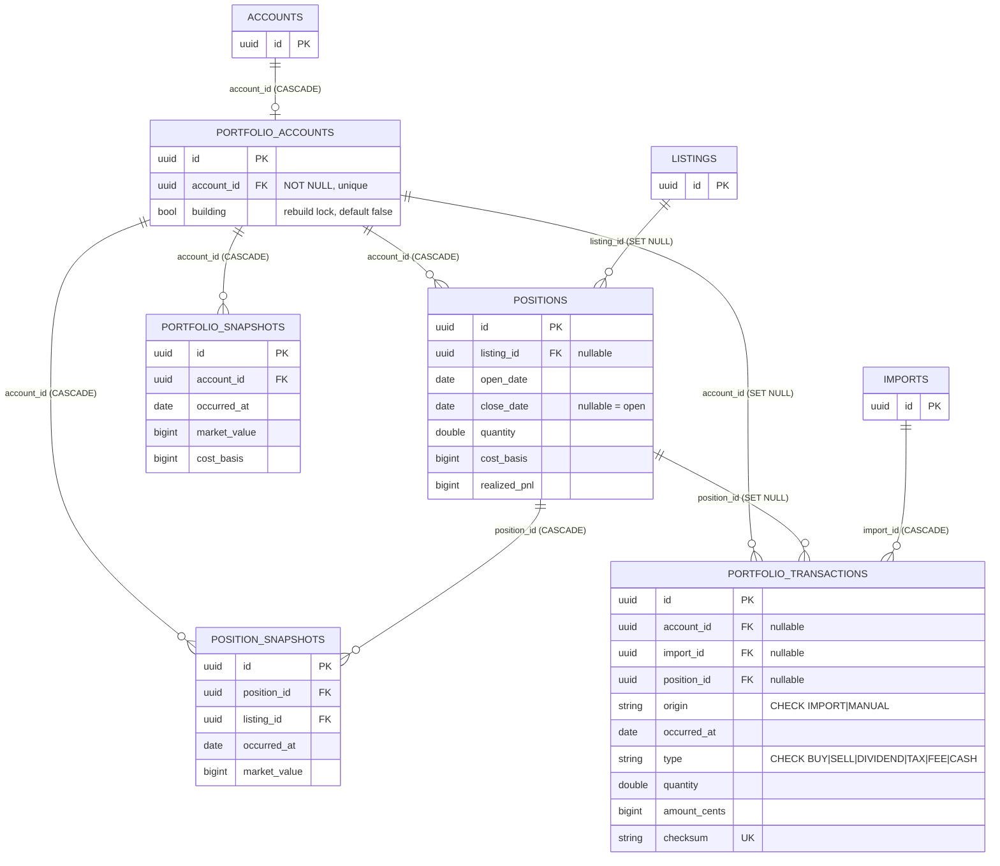
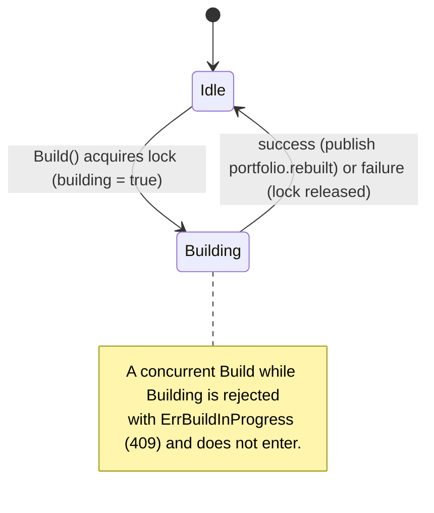
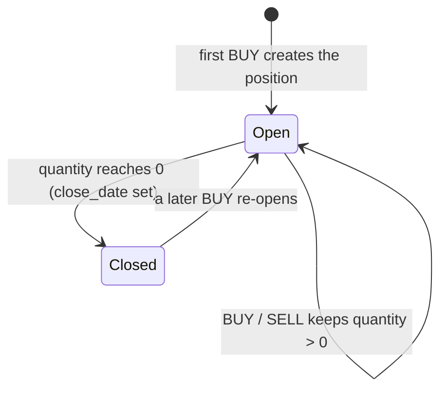
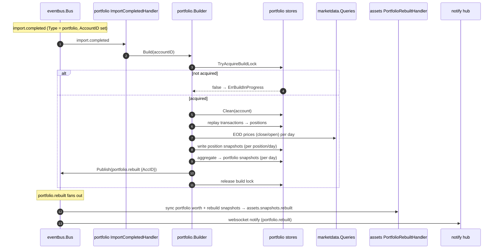

# [013]–[015] Portfolio

> **Feature IDs:** 013 (async rebuild) · 014 (read APIs) · 015 (manual transactions) · **Area:** Core (user-facing) · **Status:** refactored; not yet wired in a compiling entrypoint
>
> **Backend packages:** `internal/portfolio` · `transport/http/handlers/portfolio` · `transport/messaging/handlers/portfolio` · `internal/storage/sqlx_portfolio_store.go`
>
> **Related features:** [002] CSV imports · [003] Account management · [005] Market data · [024] Assets · [001] Realtime updates

## Overview

Portfolio computes and serves investment-account performance from a transaction stream plus
market data:

- **[014] Reads** — account snapshot time series (`GET /portfolio/snapshots`), current/closed
  positions with their latest snapshot metrics (`GET /portfolio/positions`), and filtered
  transaction history (`GET /portfolio/transactions`).
- **[015] Manual writes** — create one manual transaction (BUY/SELL/DIVIDEND/TAX/FEE/CASH).
  Manual rows are `origin = MANUAL`, carry no import, and **do not** trigger a rebuild.
- **[013] Async rebuild** — a full rebuild recomputes positions → position snapshots →
  account snapshots. It is triggered asynchronously over the event bus when a portfolio CSV
  import completes (and synchronously via `POST /portfolio/rebuild`).

## Domain model

Enums: `TransactionType` ∈ {BUY, SELL, DIVIDEND, TAX, FEE, CASH}; `TransactionOrigin` ∈
{IMPORT, MANUAL}. A position is open while `CloseDate` is nil.

## Data model

Key constraints: `ck_portfolio_transactions_import_origin` enforces `IMPORT ⇒ import_id NOT NULL`
and `MANUAL ⇒ import_id NULL`; `checksum` is unique; position snapshots are unique per
`(position_id, occurred_at)` and account snapshots per `(account_id, occurred_at)`. Physical
names: Postgres `portfolio.*`; SQLite `portfolio_accounts` / `portfolio_transactions` /
`positions` / `position_snapshots` / `portfolio_snapshots`.

## Lifecycles

**Account rebuild lock** (`portfolio.accounts.building`):

**Position** (`positions.close_date`):

## Async rebuild flow

`POST /portfolio/rebuild` runs `Builder.Build` **inline** and returns `204` only when the full
rebuild finishes. The decoupled path is import-driven:

## Endpoints

| Feature | Method + route | Key inputs | Success |
| --- | --- | --- | --- |
| [014] Snapshots | `GET /portfolio/snapshots` | query: `account_id`, `from`, `to` | 200 `[{occurred_at, market_value, total_pnl, ...}]` |
| [014] Positions | `GET /portfolio/positions` | query: `account_id`, `include_closed` | 200 `{include_closed, data[]}` |
| [014] Transactions | `GET /portfolio/transactions` | query: `account_id`, `from/to`, `limit/offset`, `sort_by/sort_order`, `q`, `type`, `origin`, `source`, `listing` | 200 `{pagination, data[]}` — **not yet backed by a store (see below)** |
| [013] Rebuild | `POST /portfolio/rebuild` | body: `account_id` | **204** (synchronous) |
| [015] Manual create | `POST /portfolio/transactions/manual` | body: `account_id`, `vendor_id`, `occurred_at`, `type`, `listing_id?`, `amount`, `quantity?`, `description?` | 201 transaction |

**Error mapping (highlights):** validation → 400; `account.ErrAccountNotFound` → 404; rebuild
`ErrBuildInProgress` → 409, `ErrPortfolioNoSnapshots` → 422; manual create maps the `ErrManual*`
family to 400/404/422 and duplicate → 409; else 500.

## Processing rules

- **Rebuild pipeline (`Builder.Build`).** Acquire the build lock (else `ErrBuildInProgress`);
  `Clean` prior positions/snapshots; replay the account's transactions in date order into
  positions (one cycle per canonical instrument key — ISIN preferred, else symbol, with
  symbol→ISIN alias promotion); for each position walk day-by-day pricing via EOD
  close→open→carry-forward→transaction-price fallback and persist one position snapshot per
  day; aggregate per-day position snapshots into account `PortfolioSnapshot` rows (net /
  cumulative cashflow, time-weighted return). Zero position snapshots ⇒ `ErrPortfolioNoSnapshots`.
  The lock is always released (fresh background context) even on cancellation.
- **Manual create** persists `origin = MANUAL`, `import_id = NULL`, `position_id = NULL`;
  CASH encodes direction in the `Quantity` sign and stores an absolute amount; BUY/SELL derive
  `unit_price = amount / quantity`. It emits no event and does not rebuild.
- **Reads.** Snapshots are ordered `occurred_at ASC` (optionally date-bounded); positions join
  their latest snapshot and can include closed positions; transactions support filter + sort
  (`date` only) + offset pagination (limit ∈ {10,25,50,100}, default 25).

## Events

| Topic | Constant | Payload | Direction | Notes |
| --- | --- | --- | --- | --- |
| `portfolio.rebuilt` | `portfolio.TopicRebuilt` | `Rebuilt{AccID}` | published | after a successful `Build`; consumed by assets sync + notify |
| `account.created` | `account.TopicCreated` | `Created{AccID}` | consumed | `AccountCreatedHandler` → `CreateAccount` (projection + lock row) |
| `import.completed` | `importer.TopicCompleted` | `Completed{ImportID, Type, AccountID}` | consumed | `ImportCompletedHandler` rebuilds only when `Type = portfolio` and `AccountID` set |

There is **no** rebuild-*request* event; the only async rebuild trigger is `import.completed`.

## Code map

| Path | Responsibility |
| --- | --- |
| `internal/portfolio/commands.go` | Manual create, projection create, bulk import insert + `CommandStore` |
| `internal/portfolio/queries.go` | Snapshot/position reads + `QueryStore` |
| `internal/portfolio/builder.go` | Rebuild engine + `PositionStore`/`PortfolioStore`/`TransactionStore`/`Locker`; publishes `portfolio.rebuilt` |
| `internal/portfolio/transaction.go` · `position.go` · `portfolio.go` · `account.go` | Domain types, position math, snapshots, projection + build errors |
| `internal/portfolio/events.go` | `TopicRebuilt` + `Rebuilt` |
| `transport/http/handlers/portfolio/{snapshots,positions,transactions,rebuild}.go` | Read + rebuild + manual-create handlers |
| `transport/messaging/handlers/portfolio/{account_created,import_completed}.go` | Projection + rebuild-on-import subscribers |
| `internal/storage/sqlx_portfolio_store.go` | `SQLXPortfolioStore` implementing all six portfolio interfaces |

## Refactor state / not implemented

- **`GET /portfolio/transactions` has no store implementation.** The handler depends on a
  `FetchForAccount(ctx, TransactionListQuery)` interface that no type implements yet, so the
  transaction-read endpoint cannot currently be served even though its query/DTO types and the
  supporting index exist.
- `PortfolioSnapshot.CashBalance` is always built as 0 (cash positions are excluded from market
  value); EOD-import-driven revaluation is intentionally not wired.
- No compiling entrypoint registers portfolio routes or subscribes the handlers (only the stale
  `cmd/server/main.go` did, against removed types).
