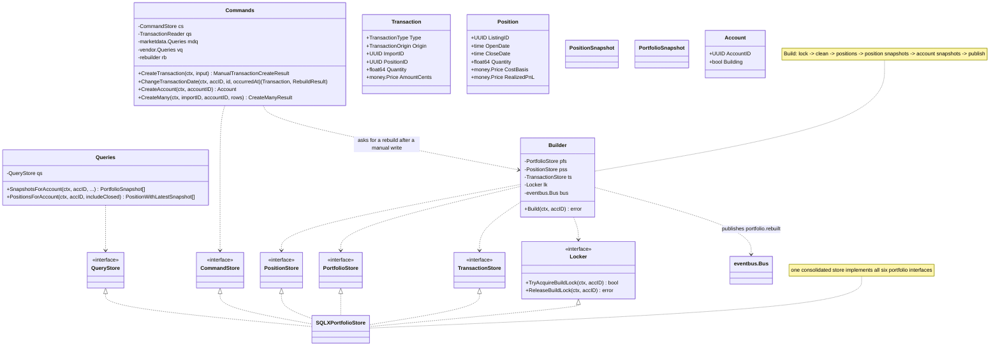
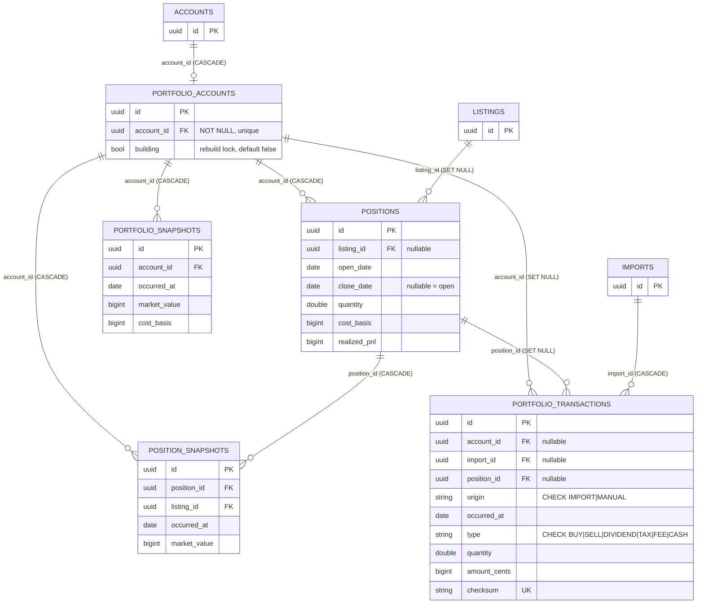
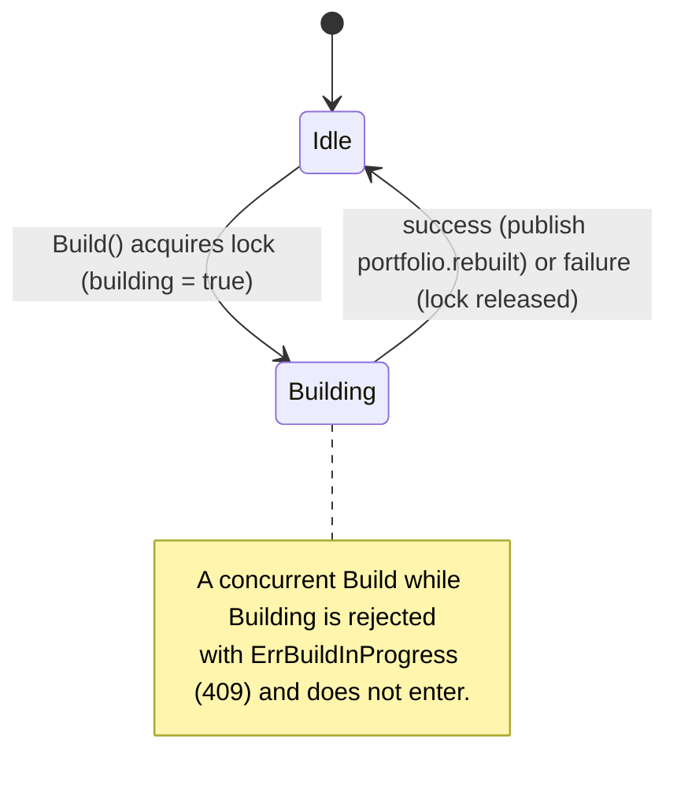
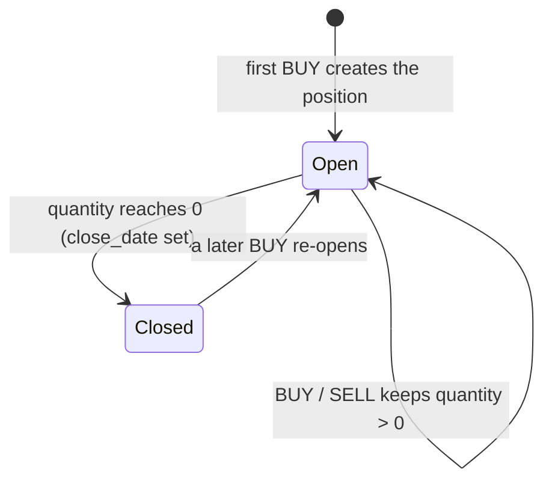
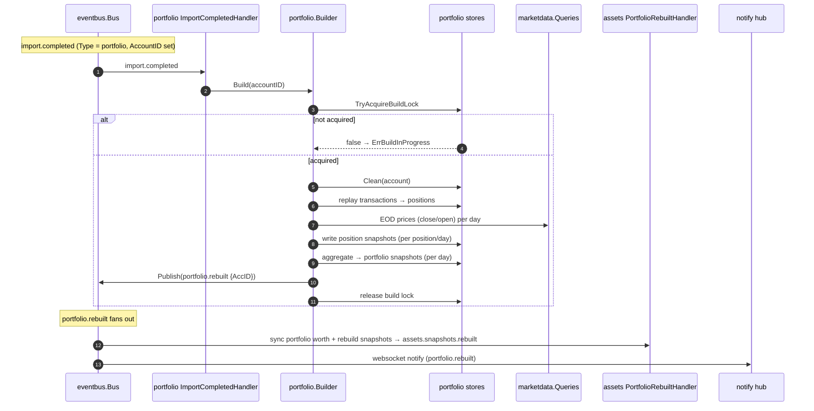

# [013]–[015],[032] Portfolio

> **Feature IDs:** 013 (async rebuild) · 014 (read APIs) · 015 (manual transactions) · 032 (date changes) · **Area:** Core (user-facing) · **Status:** live; routes registered in `cmd/ta11y/main.go`
>
> **Backend packages:** `internal/portfolio` · `transport/http/handlers/portfolio` · `transport/messaging/handlers/portfolio` · `internal/storage/sqlx_portfolio_store.go`
>
> **Related features:** [002] CSV imports · [003] Account management · [005] Market data · [024] Assets · [001] Realtime updates

## Overview

Portfolio computes and serves investment-account performance from a transaction stream plus
market data:

- **[014] Reads** — account snapshot time series (`GET /portfolio/snapshots`), current/closed
  positions with their latest snapshot metrics (`GET /portfolio/positions`), and filtered
  transaction history (`GET /portfolio/transactions`).
- **[015] Manual writes** — create one manual transaction (BUY/SELL/DIVIDEND/TAX/FEE/CASH) on
  any day up to and including today. Manual rows are `origin = MANUAL` and carry no import.
- **[032] Change date** — move one manually entered transaction to another day, today or
  earlier. Nothing else about it changes, and imported rows are refused.
- **[013] Async rebuild** — a full rebuild recomputes positions → position snapshots →
  account snapshots. It is triggered asynchronously over the event bus when a portfolio CSV
  import completes, and synchronously via `POST /portfolio/rebuild` or after a manual write.

## Domain model

```mermaid
classDiagram
    class Commands {
        -CommandStore cs
        -TransactionReader qs
        -marketdata.Queries mdq
        -vendor.Queries vq
        -rebuilder rb
        +CreateTransaction(ctx, input) ManualTransactionCreateResult
        +ChangeTransactionDate(ctx, accID, id, occurredAt) (Transaction, RebuildResult)
        +CreateAccount(ctx, accountID) Account
        +CreateMany(ctx, importID, accountID, rows) CreateManyResult
    }
    class Queries {
        -QueryStore qs
        +SnapshotsForAccount(ctx, accID, ...) PortfolioSnapshot[]
        +PositionsForAccount(ctx, accID, includeClosed) PositionWithLatestSnapshot[]
    }
    class Builder {
        -PortfolioStore pfs
        -PositionStore pss
        -TransactionStore ts
        -Locker lk
        -eventbus.Bus bus
        +Build(ctx, accID) error
    }
    class PositionStore {
        <<interface>>
    }
    class PortfolioStore {
        <<interface>>
    }
    class TransactionStore {
        <<interface>>
    }
    class Locker {
        <<interface>>
        +TryAcquireBuildLock(ctx, accID) bool
        +ReleaseBuildLock(ctx, accID) error
    }
    class CommandStore {
        <<interface>>
    }
    class QueryStore {
        <<interface>>
    }
    class SQLXPortfolioStore

    class Transaction {
        +TransactionType Type
        +TransactionOrigin Origin
        +UUID ImportID
        +UUID PositionID
        +float64 Quantity
        +money.Price AmountCents
    }
    class Position {
        +UUID ListingID
        +time OpenDate
        +time CloseDate
        +float64 Quantity
        +money.Price CostBasis
        +money.Price RealizedPnL
    }
    class PositionSnapshot
    class PortfolioSnapshot
    class Account {
        +UUID AccountID
        +bool Building
    }

    Commands ..> CommandStore
    Commands ..> Builder : asks for a rebuild after a manual write
    Queries ..> QueryStore
    Builder ..> PositionStore
    Builder ..> PortfolioStore
    Builder ..> TransactionStore
    Builder ..> Locker
    Builder ..> eventbus.Bus : publishes portfolio.rebuilt
    CommandStore <|.. SQLXPortfolioStore
    QueryStore <|.. SQLXPortfolioStore
    PositionStore <|.. SQLXPortfolioStore
    PortfolioStore <|.. SQLXPortfolioStore
    TransactionStore <|.. SQLXPortfolioStore
    Locker <|.. SQLXPortfolioStore

    note for SQLXPortfolioStore "one consolidated store implements all six portfolio interfaces"
    note for Builder "Build: lock -> clean -> positions -> position snapshots -> account snapshots -> publish"
```

Enums: `TransactionType` ∈ {BUY, SELL, DIVIDEND, TAX, FEE, CASH}; `TransactionOrigin` ∈
{IMPORT, MANUAL}. A position is open while `CloseDate` is nil.

## Data model

```mermaid
erDiagram
    ACCOUNTS           ||--o| PORTFOLIO_ACCOUNTS    : "account_id (CASCADE)"
    PORTFOLIO_ACCOUNTS ||--o{ POSITIONS             : "account_id (CASCADE)"
    PORTFOLIO_ACCOUNTS ||--o{ PORTFOLIO_TRANSACTIONS: "account_id (SET NULL)"
    PORTFOLIO_ACCOUNTS ||--o{ POSITION_SNAPSHOTS    : "account_id (CASCADE)"
    PORTFOLIO_ACCOUNTS ||--o{ PORTFOLIO_SNAPSHOTS   : "account_id (CASCADE)"
    POSITIONS          ||--o{ POSITION_SNAPSHOTS    : "position_id (CASCADE)"
    POSITIONS          ||--o{ PORTFOLIO_TRANSACTIONS: "position_id (SET NULL)"
    LISTINGS           ||--o{ POSITIONS             : "listing_id (SET NULL)"
    IMPORTS            ||--o{ PORTFOLIO_TRANSACTIONS: "import_id (CASCADE)"

    PORTFOLIO_ACCOUNTS {
        uuid id PK
        uuid account_id FK "NOT NULL, unique"
        bool building "rebuild lock, default false"
    }
    PORTFOLIO_TRANSACTIONS {
        uuid id PK
        uuid account_id FK "nullable"
        uuid import_id FK "nullable"
        uuid position_id FK "nullable"
        string origin "CHECK IMPORT|MANUAL"
        date occurred_at
        string type "CHECK BUY|SELL|DIVIDEND|TAX|FEE|CASH"
        double quantity
        bigint amount_cents
        string checksum UK
    }
    POSITIONS {
        uuid id PK
        uuid listing_id FK "nullable"
        date open_date
        date close_date "nullable = open"
        double quantity
        bigint cost_basis
        bigint realized_pnl
    }
    POSITION_SNAPSHOTS {
        uuid id PK
        uuid position_id FK
        uuid listing_id FK
        date occurred_at
        bigint market_value
    }
    PORTFOLIO_SNAPSHOTS {
        uuid id PK
        uuid account_id FK
        date occurred_at
        bigint market_value
        bigint cost_basis
    }
    ACCOUNTS { uuid id PK }
    LISTINGS { uuid id PK }
    IMPORTS  { uuid id PK }
```

Key constraints: `ck_portfolio_transactions_import_origin` enforces `IMPORT ⇒ import_id NOT NULL`
and `MANUAL ⇒ import_id NULL`; `checksum` is unique; position snapshots are unique per
`(position_id, occurred_at)` and account snapshots per `(account_id, occurred_at)`. Physical
names: Postgres `portfolio.*`; SQLite `portfolio_accounts` / `portfolio_transactions` /
`positions` / `position_snapshots` / `portfolio_snapshots`.

## Lifecycles

**Account rebuild lock** (`portfolio.accounts.building`):

```mermaid
stateDiagram-v2
    [*] --> Idle
    Idle --> Building : Build() acquires lock (building = true)
    Building --> Idle : success (publish portfolio.rebuilt) or failure (lock released)
    note right of Building
        A concurrent Build while Building is rejected
        with ErrBuildInProgress (409) and does not enter.
    end note
```

**Position** (`positions.close_date`):

```mermaid
stateDiagram-v2
    [*] --> Open : first BUY creates the position
    Open --> Open : BUY / SELL keeps quantity > 0
    Open --> Closed : quantity reaches 0 (close_date set)
    Closed --> Open : a later BUY re-opens
```

## Async rebuild flow

`POST /portfolio/rebuild` runs `Builder.Build` **inline** and returns `204` only when the full
rebuild finishes. The decoupled path is import-driven:

```mermaid
sequenceDiagram
    autonumber
    participant BUS as eventbus.Bus
    participant ICH as portfolio ImportCompletedHandler
    participant BLD as portfolio.Builder
    participant ST as portfolio stores
    participant MD as marketdata.Queries

    Note over BUS: import.completed (Type = portfolio, AccountID set)
    BUS->>ICH: import.completed
    ICH->>BLD: Build(accountID)
    BLD->>ST: TryAcquireBuildLock
    alt not acquired
        ST-->>BLD: false → ErrBuildInProgress
    else acquired
        BLD->>ST: Clean(account)
        BLD->>ST: replay transactions → positions
        BLD->>MD: EOD prices (close/open) per day
        BLD->>ST: write position snapshots (per position/day)
        BLD->>ST: aggregate → portfolio snapshots (per day)
        BLD->>BUS: Publish(portfolio.rebuilt {AccID})
        BLD->>ST: release build lock
    end

    Note over BUS: portfolio.rebuilt fans out
    participant AS as assets PortfolioRebuiltHandler
    participant NT as notify hub
    BUS->>AS: sync portfolio worth + rebuild snapshots → assets.snapshots.rebuilt
    BUS->>NT: websocket notify (portfolio.rebuilt)
```

## Endpoints

| Feature | Method + route | Key inputs | Success |
| --- | --- | --- | --- |
The account comes from the session on every route ([030]); no request carries an `account_id`.

| Feature | Method + route | Key inputs | Success |
| --- | --- | --- | --- |
| [014] Snapshots | `GET /portfolio/snapshots` | query: `from`, `to` | 200 `[{occurred_at, market_value, total_pnl, ...}]` |
| [014] Positions | `GET /portfolio/positions` | query: `include_closed` | 200 `{include_closed, data[]}` |
| [014] Transactions | `GET /portfolio/transactions` | query: `from/to`, `limit/offset`, `sort_by/sort_order`, `q`, `type`, `origin`, `source`, `listing` | 200 `{pagination, data[]}` |
| [013] Rebuild | `POST /portfolio/rebuild` | empty body | **204** (synchronous) |
| [015] Manual create | `POST /portfolio/transactions/manual` | body: `vendor_id`, `occurred_at`, `type`, `listing_id?`, `amount`, `quantity?`, `description?` | 201 transaction + `rebuild` |
| [032] Change date | `POST /portfolio/transactions/date` | body: `id`, `occurred_at` | 200 `{id, occurred_at, rebuild}` |

**Error mapping (highlights):** validation and a date after today → 400; `account.ErrAccountNotFound`
and an unknown transaction id → 404; rebuild `ErrBuildInProgress` → 409, `ErrPortfolioNoSnapshots`
→ 422; manual create maps the `ErrManual*` family to 400/404/422 and duplicate → 409; changing the
date of an imported row → 422; else 500.

`rebuild` on the two manual writes is `completed`, `in_progress`, `skipped` or `failed`. The write
itself succeeded in every case — the field only says whether positions, performance and net worth
have caught up with it, so a client can report that rather than present a stale page as current.

## Processing rules

- **Rebuild pipeline (`Builder.Build`).** Acquire the build lock (else `ErrBuildInProgress`);
  `Clean` prior positions/snapshots; replay the account's transactions in date order into
  positions (one cycle per canonical instrument key — ISIN preferred, else symbol, with
  symbol→ISIN alias promotion); for each position walk day-by-day pricing via EOD
  close→open→carry-forward→transaction-price fallback and persist one position snapshot per
  day; aggregate per-day position snapshots into account `PortfolioSnapshot` rows (net /
  cumulative cashflow, time-weighted return). Zero position snapshots ⇒ `ErrPortfolioNoSnapshots`.
  The lock is always released (fresh background context) even on cancellation.
- **Listing linking runs on every rebuild**, so a listing added after an import links the
  transactions that were already there. The match is `marketdata.Queries.ListingByIdentity`:
  the exact ISIN, or the exact symbol when the instrument has no ISIN. A present-but-unknown
  ISIN does not fall back to the symbol, and no match leaves `listing_id` null rather than
  attaching the position to a near neighbour — an unlinked position is still built, it simply
  produces no snapshots and therefore no market value. The split replay resolves listings the
  same way.
- **Import deduplication is content-based.** The unique row `checksum` covers what the row is
  plus the dedup sequence the importer stamps ([032]); the CSV line number is stored and orders
  same-day rows but is no longer part of the checksum, so a partly overlapping export is
  recognised instead of imported twice.
- **Manual create** persists `origin = MANUAL`, `import_id = NULL`, `position_id = NULL`;
  CASH encodes direction in the `Quantity` sign and stores an absolute amount; BUY/SELL derive
  `unit_price = amount / quantity`. `occurred_at` must be today or earlier. It emits no event
  of its own, but asks for a rebuild once the row is stored.
- **Moving a transaction ([032]).** Only `origin = MANUAL` rows can be moved, and only to today
  or earlier. The checksum carries the date, so it is recomputed for the new day and looked up
  within the account first; a hit that is not the row itself is refused rather than written.
  The recomputation deliberately leaves `position_id` out: a rebuild writes it onto the row long
  after the checksum was generated, so the identity to stay comparable with is the one the row
  was created under. Imported rows keep their statement date — moving one would change the
  identity the next import of the same file compares against, so it would insert the old row
  again. A move is followed by a rebuild, because the row lands elsewhere in the stream.
- **Rebuilding after a manual write.** The rebuild itself is unchanged and still refuses to run
  while one is in progress. A refusal is not a failed write: the transaction is stored either
  way and the outcome is reported, with the existing `POST /portfolio/rebuild` as the way out.
  There is no queue. It runs on a context detached from the request — `Build` cleans positions
  before it recomputes them, so a client that disconnects mid-write must not leave the account
  emptied — and the write stops *waiting* after 20s, under the transport's 30s write timeout,
  reporting `in_progress` while the rebuild carries on.
- **Reads.** Snapshots are ordered `occurred_at ASC` (optionally date-bounded); positions join
  their latest snapshot and can include closed positions; transactions support filter + sort
  (`date` only) + offset pagination (limit ∈ {10,25,50,100}, default 25).

## Events

| Topic | Constant | Payload | Direction | Notes |
| --- | --- | --- | --- | --- |
| `portfolio.rebuilt` | `portfolio.TopicRebuilt` | `Rebuilt{AccID}` | published | after a successful `Build`; consumed by assets sync + notify |
| `account.created` | `account.TopicCreated` | `Created{AccID}` | consumed | `AccountCreatedHandler` → `CreateAccount` (projection + lock row) |
| `import.completed` | `importer.TopicCompleted` | `Completed{ImportID, Type, AccountID}` | consumed | `ImportCompletedHandler` rebuilds only when `Type = portfolio` and `AccountID` set |

There is **no** rebuild-*request* event; the only async rebuild trigger is `import.completed`.

## Code map

| Path | Responsibility |
| --- | --- |
| `internal/portfolio/commands.go` | Manual create, projection create, bulk import insert + `CommandStore`, change date, |
| `internal/portfolio/queries.go` | Snapshot/position reads, `UnlinkedProducts` for one import + `QueryStore` |
| `internal/portfolio/builder.go` | Rebuild engine + `PositionStore`/`PortfolioStore`/`TransactionStore`/`Locker`; publishes `portfolio.rebuilt` |
| `internal/portfolio/transaction.go` · `position.go` · `portfolio.go` · `account.go` | Domain types, position math, snapshots, projection + build errors |
| `internal/portfolio/events.go` | `TopicRebuilt` + `Rebuilt` |
| `transport/http/handlers/portfolio/{snapshots,positions,transactions,rebuild}.go` | Read, rebuild, manual-create and change-date handlers |
| `transport/messaging/handlers/portfolio/{account_created,import_completed}.go` | Projection + rebuild-on-import subscribers |
| `internal/storage/sqlx_portfolio_store.go` | `SQLXPortfolioStore` implementing all six portfolio interfaces |

## Gaps / not implemented

- `PortfolioSnapshot.CashBalance` is always built as 0 (cash positions are excluded from market
  value); EOD-import-driven revaluation is intentionally not wired.
- **Only the date can be changed after the fact.** Amount, quantity, listing and type are fixed
  once a transaction exists, and there is no delete, so correcting anything else means
  re-entering the transaction.
- **Rebuilds are not queued.** One that cannot start because another is running is reported, not
  retried; catching up is a deliberate `POST /portfolio/rebuild`.
