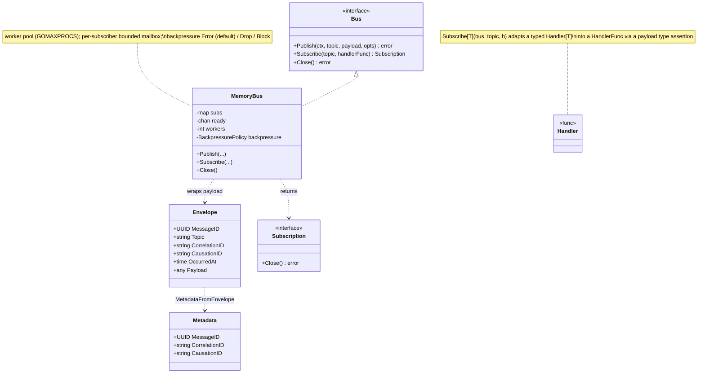
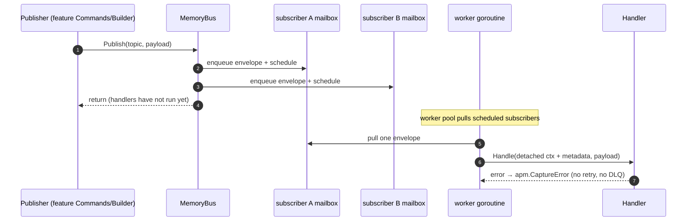
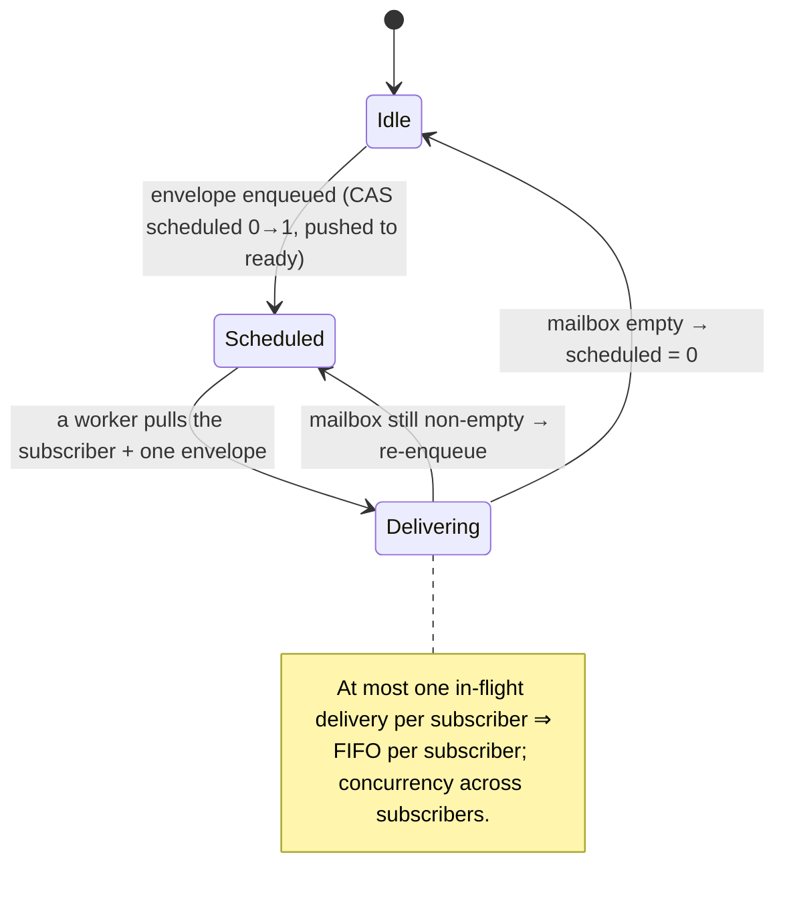

# [017] Event-Driven Messaging

> **Feature ID:** 017 · **Area:** Platform · **Status:** refactored; subscriptions not yet wired in a compiling entrypoint
>
> **Backend packages:** `internal/eventbus` (+ `eventbus/memory`) · `transport/messaging/handlers/{account,importer,portfolio,assets}` · `internal/notify`
>
> **Related features:** every feature that publishes or reacts to domain events — [002], [003], [013], [024], [001]

## Overview

`internal/eventbus` is an in-process publish/subscribe bus that provides **decoupled,
asynchronous fan-out** between feature packages. A feature's write side publishes a typed
domain event to a string topic; zero or more typed handlers subscribed to that topic react on
background worker goroutines. Each message carries identity + correlation/causation metadata,
so a chain of events published from within handlers can be traced end to end. The bus replaces
the removed `internal/jobs` background-job machinery (e.g. the importer `AcceptedHandler`
"replaces the removed background import job").

The in-memory implementation is `MemoryBus` (`internal/eventbus/memory`).

## Core types

`Publish` builds an `Envelope` (new `MessageID`, `OccurredAt`, and correlation/causation
derived from any parent metadata in context) and dispatches it. Handlers receive a **detached**
`context.Background()` carrying the message metadata — the publisher's deadline/cancellation
does not propagate, but the correlation chain does.

## Dispatch flow

## Subscriber scheduling

A `scheduled` atomic flag guarantees at most one in-flight delivery per subscriber, giving
FIFO-per-subscriber ordering while different subscribers run concurrently across the pool.

## Topic catalogue

| Topic | Constant | Payload | Publisher | Subscriber(s) |
| --- | --- | --- | --- | --- |
| `account.created` | `account.TopicCreated` | `Created{AccID}` | account create | portfolio + assets projections |
| `import.accepted` | `importer.TopicAccepted` | `Accepted{ImportID, Type}` | import accept | importer `AcceptedHandler` → `Process` |
| `import.completed` | `importer.TopicCompleted` | `Completed{ImportID, Type, AccountID, ListingID}` | import process | portfolio rebuild (portfolio type) + notify |
| `import.failed` | `importer.TopicFailed` | `Failed{…, Reason}` | import process | **none** (no subscriber) |
| `portfolio.rebuilt` | `portfolio.TopicRebuilt` | `Rebuilt{AccID}` | portfolio `Builder` | assets sync + notify |
| `assets.snapshots.rebuild_requested` | `assets.TopicSnapshotsRebuildRequested` | `SnapshotsRebuildRequested{AccID}` | assets mutation | assets rebuild handler |
| `assets.snapshots.rebuilt` | `assets.TopicSnapshotsRebuilt` | `SnapshotsRebuilt{AccID}` | assets rebuild | notify |

## Cross-feature fan-out chains

- **`account.created` → projections.** account create → portfolio projection + assets
  projection (each feature seeds its per-account state).
- **`import.accepted` → processing.** importer `AcceptedHandler` runs `Process`, which
  publishes `import.completed` / `import.failed`.
- **`import.completed` (portfolio) → rebuild → assets → notify.** portfolio `Builder.Build`
  publishes `portfolio.rebuilt` → assets sync + `RebuildAll` publishes
  `assets.snapshots.rebuilt` → realtime pushes. A single import can thus drive a multi-hop
  chain, with correlation/causation carried through each detached handler context.
- **Realtime fan-out.** `import.completed`, `portfolio.rebuilt`, and `assets.snapshots.rebuilt`
  are each also consumed by `internal/notify` to push WebSocket updates ([001]).

## Handler set

| Package | Handler | Topic | Delegates to |
| --- | --- | --- | --- |
| `messaging/handlers/portfolio` | `AccountCreatedHandler` | `account.created` | `portfolio.Commands.CreateAccount` |
| `messaging/handlers/portfolio` | `ImportCompletedHandler` | `import.completed` | `portfolio.Builder.Build` (portfolio type only) |
| `messaging/handlers/assets` | `AccountCreatedHandler` | `account.created` | `assets.Commands.CreateAccount` |
| `messaging/handlers/assets` | `PortfolioRebuiltHandler` | `portfolio.rebuilt` | `Syncer.SyncPortfolio` + `Builder.RebuildAll` → publish `assets.snapshots.rebuilt` |
| `messaging/handlers/assets` | `SnapshotsRebuildRequestedHandler` | `assets.snapshots.rebuild_requested` | `Builder.RebuildAll` → publish `assets.snapshots.rebuilt` |
| `messaging/handlers/importer` | `AcceptedHandler` | `import.accepted` | `importer.Commands.Process` |
| `internal/notify` | `ImportCompletedHandler` / `PortfolioRebuiltHandler` / `AssetsSnapshotsRebuiltHandler` | the three completion topics | `Hub.NotifyDataChanged` |

## Code map

| Path | Responsibility |
| --- | --- |
| `internal/eventbus/bus.go` | `Bus`, `Subscribe[T]`, `Handler[T]`, `HandlerFunc`, `Metadata`, `PublishOption`s |
| `internal/eventbus/envelope.go` | `Envelope` + `NewEnvelope` (identity, correlation/causation derivation) |
| `internal/eventbus/context.go` | `ContextWithMetadata` / `MetadataFromContext` (causation chaining) |
| `internal/eventbus/memory/memory_bus.go` | `MemoryBus`: worker pool, per-subscriber mailboxes, scheduling, backpressure, APM error capture |
| `internal/{account,importer,portfolio,assets}/events.go` | Topic constants + payload structs |
| `transport/messaging/handlers/*` | The typed subscribers above |

## Refactor state / not implemented

- **Subscriptions are not yet wired.** `eventbus.Subscribe[T]` has zero call sites; the only
  wiring lives in the stale `cmd/server/main.go`, which uses the removed `internal/bus` API and
  the old `api.*.MessageTopic()` model. The new entrypoint is an empty stub.
- **Delivery is at-most-once, in-memory.** No persistence (events are lost on restart), no
  retries, no dead-letter queue, and no per-handler timeout (there is an explicit `TODO`).
  Handler errors are logged + sent to APM but not retried. Under the wired `BackpressureDrop`
  policy a full mailbox silently drops the event for that subscriber.
- `import.failed` is published but currently has no subscriber.
- Removed/legacy: `internal/bus` and `internal/jobs` are deleted; `internal/messaging` is an
  empty leftover; the `codec.go` `Codec`/`CodecRegistry` scaffolding is unused by the new bus.
