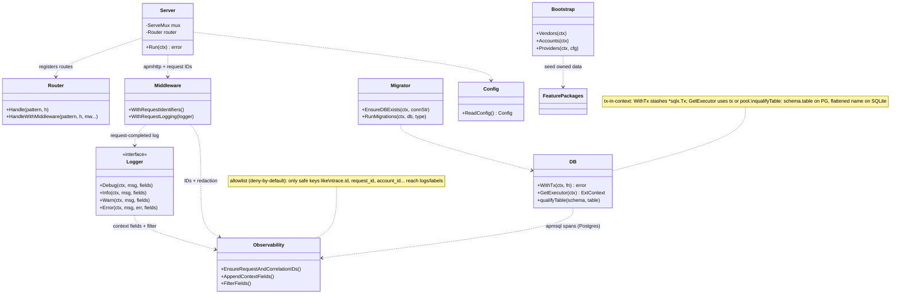
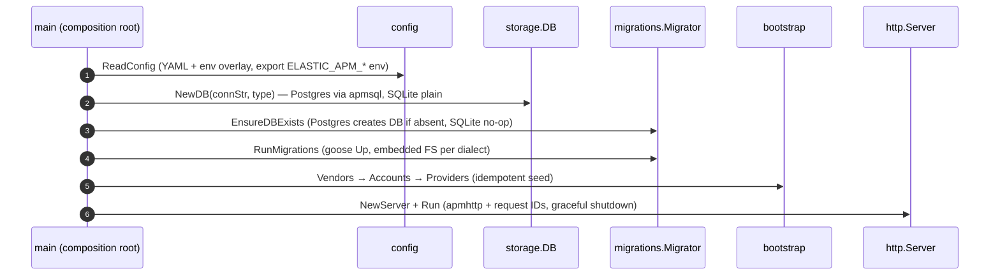
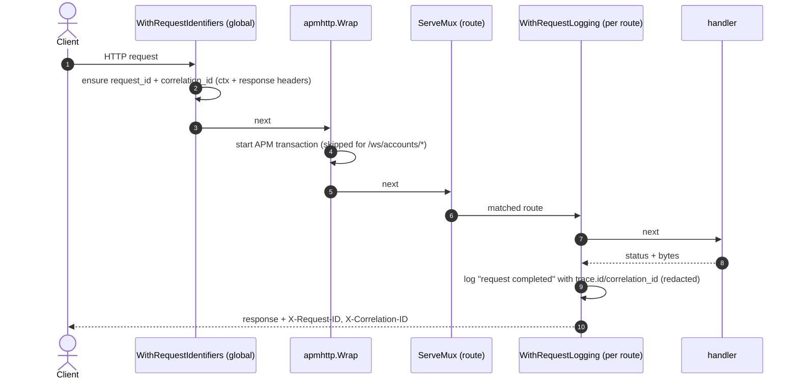

# [018]–[019],[021] Platform Operations

> **Feature IDs:** 018 (observability) · 019 (bootstrap & migrations) · 021 (health & API docs) · **Area:** Platform · **Status:** refactored; not yet wired in a compiling entrypoint
>
> **Backend packages:** `internal/logging` · `internal/observability` · `transport/http` · `internal/storage` · `migrations` · `internal/bootstrap` · `internal/config`
>
> **Related features:** all features run on this plumbing · [017] Event-driven messaging

## Overview

The platform layer is the runtime foundation every feature shares:

- **[018] Observability** — each request carries a request ID + correlation ID (generated if
  absent, echoed on response headers, stored in context), Elastic APM trace/transaction/span
  IDs are pulled from the APM context, and the `logging.Logger` slog wrapper injects those IDs
  into every structured log line. An **allowlist** redaction drops any field key that is not
  explicitly permitted. APM is wired into HTTP (`apmhttp`) and SQL (`apmsql`, Postgres only).
- **[019] Bootstrap & migrations** — goose migrations are embedded and mirrored per dialect; on
  startup the DB is auto-created (Postgres), migrated, and seeded with baseline reference data.
- **[021] Health & API docs** — `GET /health` reports liveness; `GET /swagger/` serves the
  Swagger UI from the generated `docs` package.

## Components

## Startup sequence

## Request through middleware

## Database wrapper & schema mapping

`storage.DB` embeds `*sqlx.DB` and serves both dialects from one codebase. Schema/table names
are constants; `qualifyTable`/`qualifyTableAs` prefix a Postgres schema or fall back to the
flattened SQLite name.

| Postgres schema | SQLite prefix example |
| --- | --- |
| `vendor`, `account`, `import`, `cashflow`, `portfolio`, `marketdata`, `assets` | `cashflow.transactions` → `transactions`; `portfolio.accounts` → `portfolio_accounts`; `assets.classes` → `asset_classes` |

- **Transactions:** `WithTx(ctx, fn)` stashes a `*sqlx.Tx` in context; every store calls
  `GetExecutor(ctx)` to transparently use the tx or the pool.
- **Driver:** Postgres opens via `apmsql.Open` (SQL spans under the APM transaction); SQLite
  opens plain (no APM instrumentation).
- **Unique violations:** `isUniqueViolation` abstracts pq `23505` vs SQLite `"unique"` so
  stores can map to typed `…AlreadyExists` errors (and bootstrap can treat re-runs as idempotent).

## Migrations

- Embedded via `//go:embed postgres sqlite`; the dialect's subdir is selected by connection
  type. A single consolidated init migration exists per dialect
  (`20260604120000_init.sql`) — Postgres creates 7 schemas + tables; SQLite flattens to
  prefixed bare names.
- `EnsureDBExists` creates the Postgres database if absent (SQLite: no-op); `RunMigrations`
  runs `goose Up`. Migrations are **append-only and mirrored** — never edit an existing file;
  add a new timestamped pair.

## Bootstrap seeding

| Seeder | Seeds | Idempotency |
| --- | --- | --- |
| `Vendors` | the `SupportedVendors` allow-list | skips `ErrVendorAlreadyExists` |
| `Accounts` | one default account (fixed UUID, name "Lennard Claproth") | `account.Queries.GetByID` first; tolerates `ErrAccountAlreadyExists` |
| `Providers` | API providers per configured key + the manual `brandnewday` provider | relies on provider dedupe; skips providers with no keys |

Bootstrap should respect feature ownership when seeding data: account rows go through the
`account` package, vendors through `vendor`, and providers through `marketdata`. New startup
wiring should not bypass the owning package by calling storage directly. Event behavior should
come from the feature-level function used for the seed.

During the refactor, if a bootstrap-specific feature function does not exist yet, leave that
gap explicit rather than adding a new function only to wire startup.

## Configuration

`config.yaml` (read from the working dir) overlaid with environment:

| Area | YAML keys | Env overlay |
| --- | --- | --- |
| server | `environment`, `port` | — |
| database | `connection_string`, `type` (`sqlite3`\|`postgres`) | — |
| logging | `level` | — |
| apm | `server_url`, `service_name`, `environment`, `secret_token`, `verify_server_cert`, `log_level`, `transaction_sample_rate` | exported as `ELASTIC_APM_*` (these configure the implicit default tracer) |
| providers | `marketstack.base_uri`, `alphavantage.base_uri` | **API keys env-only**: `MARKETSTACK_API_KEY`, `ALPHA_VANTAGE_API_KEY` (comma-separated, deduped) |
| disk_storage | `base_path` | — |

There is **no** `agent.enabled` / agent config (it was removed with the jobs subsystem).

## Health & API docs

| Route | Behavior |
| --- | --- |
| `GET /health` | `200 {"status":"ok"}` |
| `GET /swagger/` | Swagger UI via `httpSwagger.WrapHandler` over the generated `docs` package |

Both go through request-identifier + request-logging middleware. The `docs/` package
(`docs.go`, `swagger.json`, `swagger.yaml`) is **generated** (`make swagger`, currently
`-g cmd/server/main.go`) — never hand-edit it. The hand-authored overview is this
`docs/features/` set + `FEATURES.md`.

## Code map

| Path | Responsibility |
| --- | --- |
| `internal/logging/{logger,slog_logger}.go` | `Logger` interface + JSON slog impl (injects context fields, applies redaction) |
| `internal/observability/{context,trace,redaction}.go` | Request/correlation IDs, APM trace extraction + W3C propagation, allowlist redaction |
| `transport/http/{server,router,middlewares,writer,codec}.go` | `Server`/`Router`, middleware, response writer (+hijack), codec helpers |
| `transport/http/handlers/health.go` | `/health` |
| `internal/storage/db.go` · `errors.go` | `DB` wrapper, tx-in-context, schema/table constants, `qualifyTable`, `isUniqueViolation` |
| `migrations/migrator.go` + `migrations/{postgres,sqlite}/*_init.sql` | Embedded goose runner + mirrored schema |
| `internal/bootstrap/{vendors,accounts,providers}.go` | Startup seeding |
| `internal/config/config.go` | YAML + env config, APM env export, validation |

## Refactor state / not implemented

- **No compiling entrypoint wires this stack.** `cmd/my-finances-tracker/main.go` is an empty
  stub; `cmd/server/main.go` imports removed packages (`internal/bus`, `internal/jobs`,
  `internal/http`, `internal/cashflow/service`) and reads a non-existent `cfg.Agent.*`, so it
  does not compile. Consequently `transport/http`, `internal/bootstrap`, `internal/eventbus`,
  and `migrations` are not exercised by any buildable `main`.
- SQLite is not APM-instrumented (only Postgres goes through `apmsql`).
