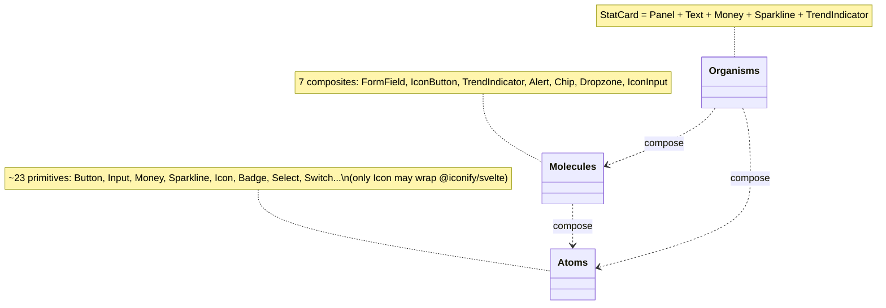

# [020] Web App

> **Feature ID:** 020 · **Area:** Platform (frontend) · **Status:** early-stage — component library only (no application wiring yet)
>
> **Location:** `web/` (NOT `apps/web`) · SvelteKit 2 + Svelte 5
>
> **Related features:** consumes (eventually) the [003]/[009]/[013]/[024] APIs and the [001] WebSocket

## Overview

The web app today is an **Atomic-Design UI primitive catalog** built and tested through
Storybook — roughly 30 reusable Svelte 5 components (atoms / molecules / organisms) with
co-located stories that double as the test corpus (Vitest browser mode).

It is **not yet a functioning application**: there are no feature pages, no data fetching, no
WebSocket client, no global state, and no auth/admin gating. Running `npm run dev` renders the
stock SvelteKit welcome page. `FEATURES.md`'s description of pages "consuming the API" is
**intent, not current behavior** (see [Gaps](#gaps--not-implemented)).

## Component architecture

The implemented surface is the lower three Atomic-Design tiers; `templates/` and `pages/`
don't exist yet.

**Co-location convention** (one folder per component): `Component.svelte` (markup + runes),
`component.types.ts` (`as const` option arrays → derived union types), `component.variants.ts`
(Tailwind class maps), and `Component.stories.svelte` (Storybook CSF). Simple atoms may inline
types/variants.

## Tech stack & scripts

| Concern | Package(s) |
| --- | --- |
| Framework | `@sveltejs/kit` ^2.57, `svelte` ^5.55 (runes mode forced) |
| Build | `vite` ^8, `@sveltejs/adapter-auto` |
| Styling | `tailwindcss` ^4.2 (+ `@tailwindcss/vite`, `@tailwindcss/typography`) |
| Icons | `@iconify/svelte` |
| Storybook | `storybook` / `@storybook/sveltekit` ^10.3 (+ a11y, docs, vitest, svelte-csf addons) |
| Tests | `vitest` ^4 (browser mode via `@vitest/browser-playwright`), `playwright` |
| Quality | `svelte-check`, `eslint` ^10 + `typescript-eslint`, `prettier` |

Scripts (in `web/`): `dev`, `build`, `preview`, `check` (svelte-check), `lint`
(prettier + eslint), `format`, `storybook`, `build-storybook`. **There is no `test` script** —
coverage comes from Storybook stories run under Vitest browser mode.

## Route map

| Route | File | Purpose |
| --- | --- | --- |
| `/` | `web/src/routes/+page.svelte` | Default SvelteKit welcome page (placeholder) |
| layout | `web/src/routes/+layout.svelte` | Root layout (favicon, `{@render children()}`, imports `layout.css`) |

No cashflow / portfolio / assets / admin routes exist yet, and there is no admin-mode guard,
no `hooks.*`, and no `+server.ts`/`+page.server.ts`.

## Planned (not yet implemented) integration

The backend exposes the REST API and the `/ws/accounts/{account_id}` WebSocket, but the
frontend has **no code** that calls either. A future page → API → WebSocket-refresh flow would
be the natural integration, but no service layer, fetch wrapper, shared DTOs, or WS client
exist today, so no request/realtime sequence is documented here (it would be fabricated).

## Code map

| Path | Responsibility |
| --- | --- |
| `web/package.json` | Deps + scripts (no `test`) |
| `web/svelte.config.js` | Forces runes mode; `adapter-auto` |
| `web/vite.config.ts` | Tailwind + SvelteKit plugins; Vitest Storybook browser project |
| `web/.storybook/*` | Storybook config (stories glob, addons, preview) |
| `web/src/routes/*` | Root layout + welcome page (only) |
| `web/src/lib/components/atoms/*` | 23 primitive components |
| `web/src/lib/components/molecules/*` | 7 composite components |
| `web/src/lib/components/organisms/stat-card/*` | `StatCard` organism |
| `web/src/app.css` | Theme tokens — imported only by Storybook |

## Gaps / not implemented

- **No application wiring:** no feature pages, no routing/navigation shell, no API integration
  (no fetch/service layer, no shared DTOs), no WebSocket client, no global stores, no
  date-range/calendar selector, no app-level error boundary, no client APM/error reporting.
- **No admin-mode gating** (no admin routes, no guard).
- **`templates/` and `pages/` Atomic tiers** are not created yet.
- **Tooling discrepancies:** the root `Makefile` points `WEB_DIR` at `apps/web` (the real dir
  is `web/`), so `make web-lint` fails — run scripts inside `web/`. The running app loads
  `routes/layout.css` while the real theme lives in `src/app.css` (imported only by Storybook),
  so app and Storybook render differently; a referenced `taupe` color is undefined; and Prettier
  is configured for tabs while many files use 2-space indent (so `lint` isn't green out of the box).
