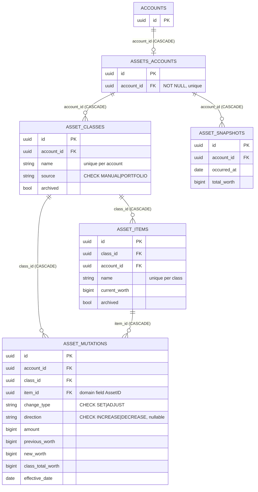
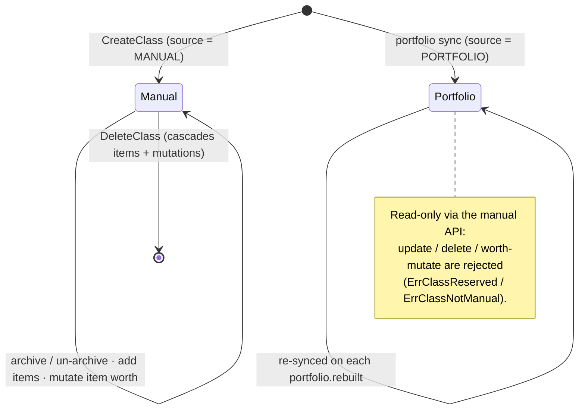
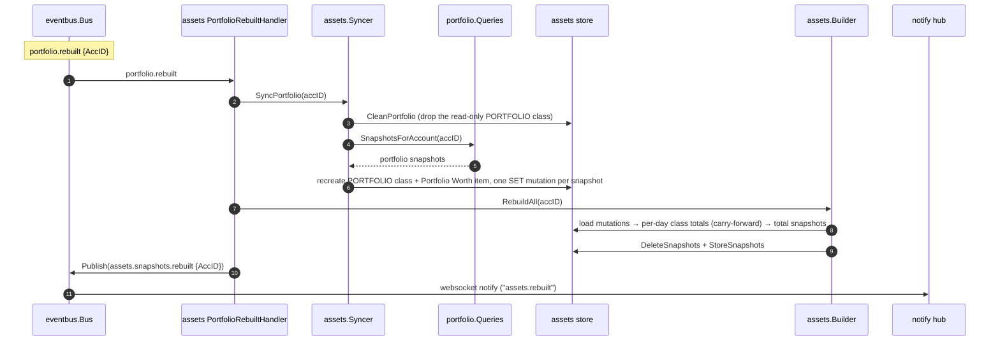

# [024]–[025] Assets

> **Feature IDs:** 024 (asset management) · 025 (portfolio-linked class sync) · **Area:** Core (user-facing) · **Status:** refactored; not yet wired in a compiling entrypoint
>
> **Backend packages:** `internal/assets` · `transport/http/handlers/assets` · `transport/messaging/handlers/assets` · `internal/storage/sqlx_assets_store.go`
>
> **Related features:** [003] Account management · [013] Portfolio · [001] Realtime updates · [017] Event-driven messaging

## Overview

Assets tracks an account's net worth across **classes** (groupings) that contain **items**
(concrete assets). Every worth change is an immutable **mutation** that records the item's
previous/new worth and the class total at that point; account-level **snapshots** roll those
up into a daily total-worth series.

- **[024] Manual management** — create/update/delete manual classes; add items with an initial
  worth; change an item's worth by absolute **SET** or directional **ADJUST**; read class lists,
  class detail (items + growth + mutations), and total snapshots (`GET /assets/snapshots`).
- **[025] Portfolio sync** — on `portfolio.rebuilt`, a **read-only** `PORTFOLIO` class (name
  `"Portfolio"`, item `"Portfolio Worth"`) is rebuilt from the portfolio snapshots, then total
  snapshots are rebuilt and `assets.snapshots.rebuilt` is published for realtime fan-out.

## Domain model

```mermaid
classDiagram
    class Commands {
        +CreateAsset(...) Asset
        +CreateClass(ctx, accID, name) Class
        +UpdateAssetWorth(...) error
        +UpdateClass(ctx, classID, name, archived) error
        +DeleteClass(ctx, accID, classID) error
        +CreateAccount(ctx, accID) Account
    }
    class Queries {
        +ListClasses(ctx, accID, includeArchived) ClassSummary[]
        +ClassDetails(ctx, classID, accID) ClassDetails
        +ListSnapshots(ctx, accID, from, to) GrowthPoint[]
    }
    class Syncer {
        +SyncPortfolio(ctx, accID) error
    }
    class Builder {
        +RebuildAll(ctx, accID) error
    }
    class CommandStore { <<interface>> }
    class CommandGetter { <<interface>> }
    class ClassAggregator { <<interface>> }
    class UnitOfWork { <<interface>> }
    class QueryStore { <<interface>> }
    class SyncStore { <<interface>> }
    class BuilderStore { <<interface>> }
    class SQLXAssetsStore

    class Class {
        +ClassSource Source
        +string Name
        +bool Archived
    }
    class Asset {
        +UUID ClassID
        +money.Price CurrentWorth
    }
    class Mutation {
        +ChangeType ChangeType
        +ChangeDirection Direction
        +money.Price PreviousWorth
        +money.Price NewWorth
        +money.Price ClassTotalWorth
        +time EffectiveDate
    }
    class Snapshot {
        +time OccurredAt
        +money.Price TotalWorth
    }

    Commands ..> CommandStore
    Commands ..> ClassAggregator
    Commands ..> eventbus.Bus : publishes snapshots.rebuild_requested
    Queries ..> QueryStore
    Syncer ..> SyncStore
    Syncer ..> portfolio.Queries : reads portfolio snapshots
    Builder ..> BuilderStore
    CommandStore <|.. SQLXAssetsStore
    QueryStore <|.. SQLXAssetsStore
    SyncStore <|.. SQLXAssetsStore
    BuilderStore <|.. SQLXAssetsStore

    note for SQLXAssetsStore "one store implements all seven assets interfaces"
    note for Class "Source MANUAL (user) or PORTFOLIO (read-only, synced)"
```

Enums: `ClassSource` ∈ {MANUAL, PORTFOLIO}; `ChangeType` ∈ {SET, ADJUST}; `ChangeDirection` ∈
{INCREASE, DECREASE}. The name `"Portfolio"` is reserved for the synced class.

## Data model

Physical names: Postgres `assets.accounts` / `assets.classes` / `assets.items` /
`assets.mutations` / `assets.snapshots`; SQLite `assets_accounts` / `asset_classes` /
`asset_items` / `asset_mutations` / `asset_snapshots`. The mutations table column is `item_id`
(the domain `Mutation.AssetID`); the store aliases it on read/write. Snapshots are unique per
`(account_id, occurred_at)`.

## Class lifecycle

## Portfolio sync flow ([025])

The same `RebuildAll` runs from an **internal** trigger too: every manual class/asset mutation
publishes `assets.snapshots.rebuild_requested`, which a handler turns into a `RebuildAll` +
`assets.snapshots.rebuilt` — decoupling the write path from snapshot recomputation.

## Endpoints

| Capability | Method + route | Key inputs | Success |
| --- | --- | --- | --- |
| Create item | `POST /assets` | body: `account_id`, `class_id`, `name`, `initial_worth`, `effective_date`, `note?` | 201 `{id, name}` |
| Set worth | `PUT /assets/{asset_id}/worth` | body: `account_id`, `worth`, `effective_date`, `note?` | 204 |
| Adjust worth | `PUT /assets/{asset_id}/adjust` | body: `account_id`, `direction`, `amount`, `effective_date`, `note?` | 204 |
| Create class | `POST /assets/classes` | body: `account_id`, `name` | 201 `{id}` |
| Update class | `PATCH /assets/classes` | body: `account_id`, `id`, `name?`, `archived?` | 204 |
| Delete class | `DELETE /assets/classes/{class_id}` | body: `account_id` | 204 |
| List classes | `GET /assets/classes` | query: `account_id`, `include_archived` | 200 `[{..., current_worth, growth_pct}]` |
| Class detail | `GET /assets/classes/{class_id}` | query: `account_id` | 200 `{class, assets, growth, mutations}` |
| Total snapshots | `GET /assets/snapshots` | query: `account_id`, `from?`, `to?` | 200 `[{date, total_worth}]` |

**Error mapping (highlights):** worth-mutation `ErrAssetNotFound` / `ErrClassAccountMismatch` →
404, `ErrClassReserved` → 400; otherwise 500. (Several write handlers currently collapse domain
errors into 500 — see [Refactor state](#refactor-state--not-implemented).)

## Processing rules

- **Worth mutations.** `SET` records the new absolute worth; `ADJUST` applies an
  `INCREASE`/`DECREASE`. Each mutation stores `previous_worth`, `new_worth`, and the recomputed
  `class_total_worth` (sum of the class's non-archived items via `AggregateValue`), and updates
  the item's `current_worth`. The `PORTFOLIO` class rejects manual worth mutations.
- **Class growth %** is computed from inception: `(latest − first) / |first| × 100` using the
  earliest and latest mutation `class_total_worth`.
- **Total snapshots (`Builder.RebuildAll`).** Mutations are read ascending; per class the last
  `class_total_worth` seen each calendar day is kept, then days are walked from the earliest
  mutation through today carrying each class's last-known total forward and summing across
  classes into one `Snapshot` per day. Persisted delete-all-then-insert, upserted on
  `(account_id, occurred_at)`. No mutations ⇒ a single zero-worth snapshot dated today.
- **Portfolio sync.** `SyncPortfolio` drops and recreates the `PORTFOLIO` class each run; the
  item's current worth is the **latest** portfolio snapshot's market value, and one `SET`
  mutation is written per portfolio snapshot (effective on the snapshot day) so the class's
  growth mirrors the portfolio.

## Events

| Topic | Constant | Payload | Direction | Notes |
| --- | --- | --- | --- | --- |
| `assets.snapshots.rebuild_requested` | `assets.TopicSnapshotsRebuildRequested` | `SnapshotsRebuildRequested{AccID}` | published | after every class/asset mutation; consumed within the feature |
| `assets.snapshots.rebuilt` | `assets.TopicSnapshotsRebuilt` | `SnapshotsRebuilt{AccID}` | published | after a rebuild; consumed by notify → websocket `"assets.rebuilt"` |
| `portfolio.rebuilt` | `portfolio.TopicRebuilt` | `Rebuilt{AccID}` | consumed | triggers `SyncPortfolio` + `RebuildAll` |
| `account.created` | `account.TopicCreated` | `Created{AccID}` | consumed | `AccountCreatedHandler` → `CreateAccount` (projection) |

## Code map

| Path | Responsibility |
| --- | --- |
| `internal/assets/commands.go` | Write side + `CommandStore`/`CommandGetter`/`ClassAggregator`/`UnitOfWork`; publishes rebuild-requested |
| `internal/assets/queries.go` | Read side (class list/detail, snapshots) + `QueryStore` |
| `internal/assets/syncer.go` | `Syncer` + `SyncStore`; portfolio → `PORTFOLIO` class sync |
| `internal/assets/builder.go` | `Builder` + `BuilderStore`; rebuilds total snapshots from mutations |
| `internal/assets/{class,asset,mutation,snapshot,account}.go` | Domain types + enums + validation |
| `internal/assets/events.go` | Topic constants + payloads |
| `transport/http/handlers/assets/*.go` | Item create, worth set/adjust, class CRUD/list/detail, snapshots |
| `transport/messaging/handlers/assets/{account_created,portfolio_rebuilt,snapshots_rebuild_requested}.go` | Projection + sync + rebuild subscribers |
| `internal/storage/sqlx_assets_store.go` | `SQLXAssetsStore` implementing all seven assets interfaces |

## Refactor state / not implemented

- **Sync locking is a no-op.** `TryAcquireSyncLock`/`ReleaseSyncLock` always succeed because
  the assets schema has no per-account lock column (the domain `Account.Building` field has no
  backing column), so `ErrSyncInProgress` is unreachable. Concurrent portfolio syncs are not
  guarded at the store level.
- **HTTP write error mapping is incomplete:** `CreateAsset` / `CreateClass` / `UpdateClass`
  collapse domain errors (`ErrAccountNotFound`, `ErrClassNotFound`, `ErrClassAlreadyExists`)
  into 500s despite documenting 400/404/409.
- No compiling entrypoint registers assets routes or subscribes the handlers (only the stale
  `cmd/server/main.go` did, against a removed `assets.NewService` API).
