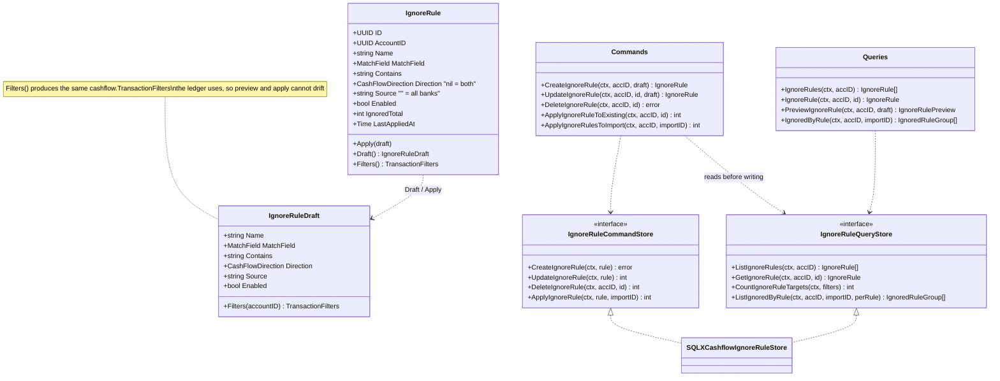
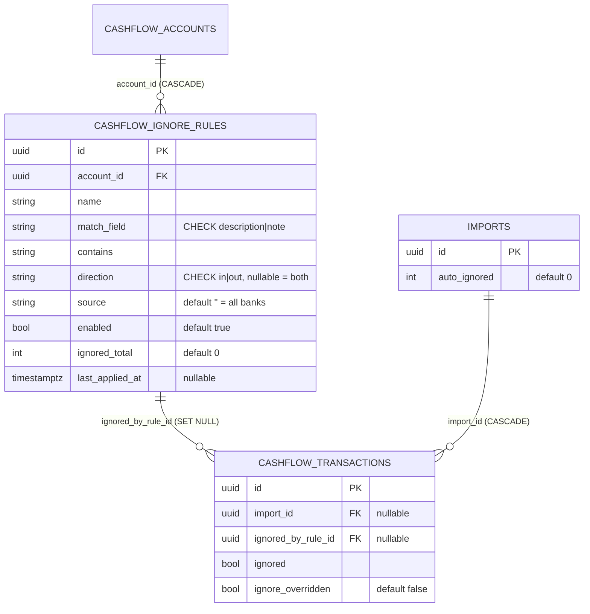
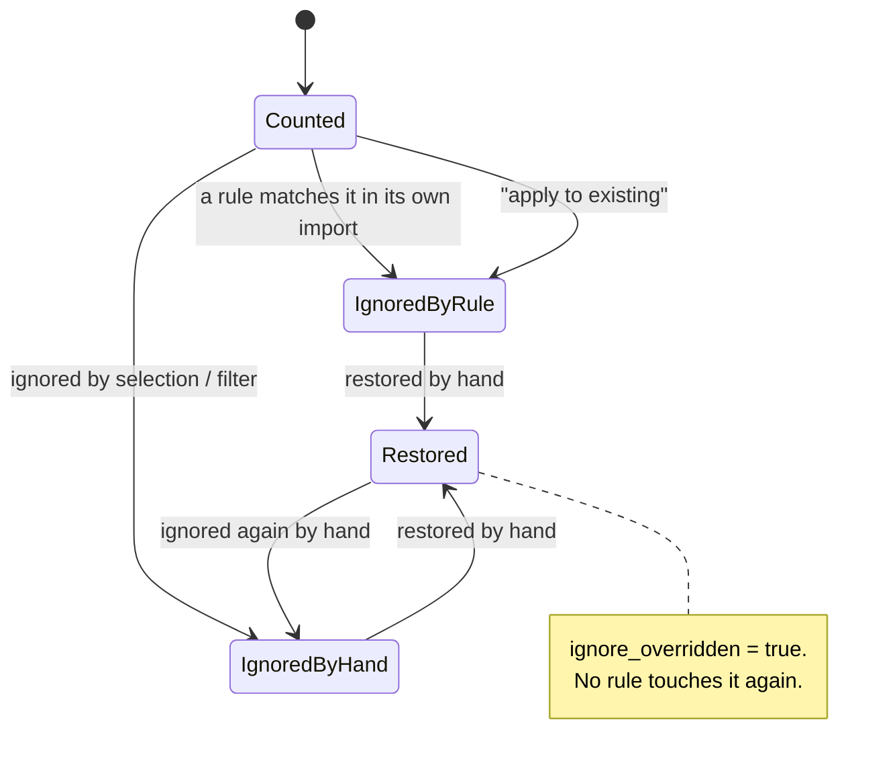

# [033] Ignore rules

> **Feature IDs:** 033 · **Area:** Core (user-facing) · **Status:** live; routes registered in `cmd/ta11y/main.go`
>
> **Backend packages:** `internal/cashflow` · `transport/http/handlers/cashflow` · `internal/storage/sqlx_cashflow_ignore_rule_store.go` · `internal/importer/cashflow`
>
> **Related features:** [009]–[012] Cashflow (same store, same filters) · [002] CSV imports (where rules run) · [020] Web portal

## Overview

Around a third of an imported bank statement is transfers between the owner's own
accounts and credit-card settlements. They say nothing about income or spending, but
they arrive as ordinary transactions and used to be ignored by hand after every import —
which, at that volume, did not happen completely.

An **ignore rule** recognises them. A rule is deliberately the same shape as a ledger
filter — text in the description *or* the note, optionally narrowed to a direction and to
one bank — so what it catches can be previewed with the query the ledger itself runs, and
nothing is inferred. There is no learning and no matching of the two sides of a transfer
against each other: each side is recognised on its own.

## Domain model

`MatchField` ∈ {`description`, `note`}. A draft is refused when the name is empty or over
120 characters, the match field is not one of the two, the direction is not empty/`in`/`out`,
or the text is under 3 or over 255 characters. The lower bound is the one that matters: a
one- or two-character rule matches most of a statement, and the damage is silent.

## Data model

Physical names: Postgres `cashflow.ignore_rules`; SQLite `cashflow_ignore_rules`.
Migration pair `20261010120000_cashflow_ignore_rules.sql`.

**`ignore_overridden`** is the invariant the whole feature rests on: it records that a
row's ignored state was decided by a person. Every by-hand ignore/restore sets it, and
rules skip every row carrying it — which is what makes restoring a row stick across later
imports and later applications of the same rule.

## When a rule runs

Rules run at exactly two moments, and never anywhere else:

1. **On import.** After the cashflow processor's bulk insert, every *enabled* rule of the
   account runs against `import_id = <this import>`. A duplicate keeps the import it first
   arrived with, so re-importing the same statement offers the rules nothing to catch. The
   number ignored is stored on the import as `auto_ignored`.
2. **On request.** `POST /cashflow/ignore-rules/{rule_id}/apply` runs one rule over the
   whole ledger. It is the only path that changes transactions that are already there, so
   it is never implied by saving a rule.

Manual entry never triggers a rule. Editing or disabling a rule says what it catches from
then on; what it already ignored keeps its state and is restored row by row. Deleting a
rule is the same — the foreign key nulls the attribution, nothing is un-ignored.

## Endpoints

| Capability | Method + route | Key inputs | Success |
| --- | --- | --- | --- |
| List rules | `GET /cashflow/ignore-rules` | — | 200 `{data[]}` |
| Create rule | `POST /cashflow/ignore-rules` | body: `name`, `match_field`, `contains`, `direction?`, `source?`, `enabled?` | 201 `{rule}` |
| Update rule | `PUT /cashflow/ignore-rules/{rule_id}` | same body | 200 `{rule}` |
| Delete rule | `DELETE /cashflow/ignore-rules/{rule_id}` | — | 204 |
| Preview | `POST /cashflow/ignore-rules/preview` | same body | 200 `{matching, not_yet_ignored, scanned, sample[]}` |
| Apply to existing | `POST /cashflow/ignore-rules/{rule_id}/apply` | — | 200 `{ignored_count, status}` |
| What an import ignored | `GET /cashflow/imports/{import_id}/ignored` | — | 200 `{data[]}` grouped by rule |

Restoring reuses the existing ignore endpoints ([012]); `filters` there gained `import_id`
and `ignored_by_rule`, which is what "restore everything this rule caught in this import"
asks for. `GET /cashflow/transactions` gained the same two as query parameters, and every
transaction in a cashflow response now carries `ignored_by_rule_id`, `ignore_overridden`
and `import_id`.

**Error mapping:** a refused draft → 400 keyed by the field it is about (`name`,
`match_field`, `contains`, `direction`), so the form puts the message next to the input
that caused it; an unknown rule → 404; store errors → 500.

## Processing rules

- **What a rule matches.** `IgnoreRuleDraft.Filters` produces a `cashflow.TransactionFilters`
  with the text on `description` *or* `note` (never both), the direction, and the source.
  The ledger's own case-insensitive `LIKE %v%` does the text matching, so preview, apply and
  import can never disagree about what a rule catches. The bank is the exception: it is
  chosen from a list of names rather than typed, so it narrows on `SourceExact`
  (`LOWER(source) = ?`) and a rule scoped to one bank cannot reach another whose name
  contains it.
- **What a rule may touch.** `ignored = false AND ignore_overridden = false`, within the
  account, plus `import_id = ?` when scoped to an import. `CountIgnoreRuleTargets` counts
  exactly that set, which is the number the confirmation before "apply to existing" names.
- **Attribution.** Applying a rule sets `ignored_by_rule_id`. Ignoring by hand clears it —
  the ledger should not credit a rule for a decision it did not make. Restoring by hand
  leaves it, so the import review can say the rule caught the row *and* that it was put
  back.
- **Counters.** A successful apply adds its count to the rule's `ignored_total` and stamps
  `last_applied_at`. Editing a rule never resets them.
- **A failed rules pass.** If applying the rules after an import's insert fails, the import
  is marked failed and still reports `total_rows` / `imported` / `duplicates` /
  `auto_ignored`: the rows are in the ledger, and the rules that ran before the failure have
  already ignored theirs, so every counter travels with the failure rather than leaving the
  person to guess which rows are unreviewed. The pass stops at the failing rule; the ones
  after it never ran, and applying them to the ledger afterwards is the way back.

## Events

Ignore rules publish no events and subscribe to none. They run synchronously inside the
cashflow import processor, before the import is marked completed, so the existing
`import.completed` signal already means "the rules have run".

## Code map

| Path | Responsibility |
| --- | --- |
| `internal/cashflow/ignore_rule.go` | `IgnoreRule`, `IgnoreRuleDraft`, validation, `Filters` |
| `internal/cashflow/ignore_rule_commands.go` | CRUD + both apply paths, the two store interfaces |
| `internal/cashflow/ignore_rule_queries.go` | Preview, grouped import harvest |
| `internal/cashflow/errors.go` | Rule errors (`ErrIgnoreRule*`) |
| `internal/storage/sqlx_cashflow_ignore_rule_store.go` | Both interfaces: rule SQL, the apply UPDATE, the per-rule grouping |
| `transport/http/handlers/cashflow/ignore_rules.go` | All seven handlers + DTOs |
| `internal/importer/cashflow/processor.go` | Runs the rules over the rows the import inserted |
| `web/src/lib/services/ignoreRules.ts` | Web service + fixture branch |
| `web/src/routes/cashflow/ignore-rules/` | The rules page |
| `web/src/routes/cashflow/imports/[import_id]/` | The import review |

## Gaps / not implemented

- **A rule matches one field, not both.** A payment that lands in the description at one
  bank and in the note at another needs two rules.
- **The bank scope is the import source, not an account.** A cashflow transaction has no
  account of its own — only the vendor it was imported from — so `source` is what a rule
  can honestly narrow on.
- **No bulk apply.** Applying runs one rule at a time, synchronously; there is no "apply
  all rules to the ledger" and no async path for a very large match set.
- **Nothing is suggested.** Rules are written by hand. The Cashflow page prefills a draft
  from the shared leading text of the selected descriptions, which is a starting point for
  the preview, not a proposal the application stands behind.
