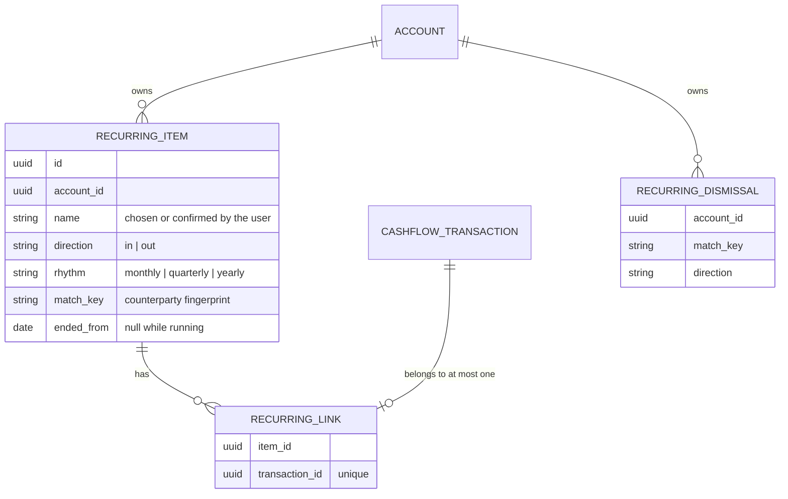

# [033] Recurring items

> **Feature ID:** 033 · **Area:** Core (user-facing) · **Status:** live; routes registered in `cmd/ta11y/main.go`
>
> **Backend packages:** `internal/cashflow` (`recurring*.go`) · `transport/http/handlers/cashflow` (`recurring_*.go`) · `internal/storage/sqlx_recurring_store.go` · `transport/messaging/handlers/cashflow`
>
> **Frontend:** `web/src/routes/recurring` · `web/src/lib/services/recurring.ts`
>
> **Related features:** [009]–[012] Cashflow (the transactions this is built from) · [002] CSV imports (links new rows)

## Overview

A subscription, fixed cost or recurring income is not a property of one transaction but of
the series of transactions that keep arriving for one counterparty. A recurring **item** is
therefore its own record that transactions are **linked** to. Items are deliberately
unrelated to the tag and the ignored flag: marking changes neither, so the tag distribution
and the monthly totals on Cashflow do not move.

Items arrive two ways, and both need the user:

- **Marked** — the user points one or more cashflow transactions at an item, existing or new.
- **Suggested** — ta11y finds patterns in the account's history and offers them. A suggestion
  counts for nothing until it is confirmed; a dismissed one is never offered again.

Once an item is confirmed, the rows of a later cashflow import that match it are linked to it
automatically, so a recurring payment has to be pointed at once rather than after every
statement.

## Domain model

Everything the screens show about an item is **read off its links**, not stored: the observed
amounts and their dates, the last amount, the last sighting, the number of transactions, and
the next expected day. Nothing is denormalised, so a correction (an unlink) is immediately the
truth.

### Match key

"To whom" exists only inside the statement description, and every bank spells it differently.
`MatchKeyFor` reduces a description to a fingerprint — lowercased words, with digits, symbols
and statement boilerplate (`naam`, `omschrijving`, `incasso`, mandate references…) dropped,
then the first four words. It is a heuristic for **grouping and linking only**; the name an
item carries is always the user's.

### Rhythm and expectation

Only `monthly`, `quarterly` and `yearly` exist. The next expected day is the last linked
transaction's day plus the rhythm. An item that is ended, or has nothing linked yet, carries
no expectation at all rather than an invented one.

### Ending

Ending is a date, not a delete. `ended_from` is the first day of a month; everything linked
before it stays linked and keeps its history, nothing after it is linked automatically, and
the item moves to the *Ended* group.

## Processing rules

**Suggestions** (`RecurringQueries.Suggestions`) read only transactions that are neither
ignored nor already linked. Rows are grouped by (match key, direction); a group is offered
when it has at least three transactions and **every** gap between them falls inside one
rhythm's band (24–38, 80–100 or 350–380 days). One gap outside the band leaves the group
alone — an irregular series gets no expectation rather than a guessed one. Groups whose key
already belongs to an item, or was dismissed, are skipped.

**Linking after an import** (`RecurringCommands.LinkImported`, driven by the
`import.completed` handler for cashflow imports) walks the account's running items and links
the import's unlinked rows whose fingerprint and direction match and whose amount sits within
25% of the item's most recent amount. The tolerance is wide enough for a variable bill like
energy and narrow enough that an unrelated payment to the same counterparty is left in
Cashflow. The database holds the "one item per transaction" rule, so a row already linked is
left where it is.

**Monthly totals** spread a quarterly amount over three months and a yearly one over twelve.
The trend series totals those monthly equivalents per month, backwards only: each month
carries the most recent amount observed up to and including it, and an item that had not
arrived yet contributes nothing. It is a reading of what happened, never a forecast.

## Events

Subscribes to `import.completed` (`transport/messaging/handlers/cashflow/import_completed.go`),
ignoring every import type but cashflow. Publishes nothing: recurring items raise no
notification, in or outside the app.

## Code map

| Concern | File |
| --- | --- |
| Domain: rhythm, item, match key, tolerance | `internal/cashflow/recurring.go` |
| Writes: create, update, link, unlink, end, confirm, dismiss, link-after-import | `internal/cashflow/recurring_commands.go` |
| Reads: overview, item detail, suggestions, totals and trend | `internal/cashflow/recurring_queries.go` |
| Persistence (both dialects) | `internal/storage/sqlx_recurring_store.go` |
| Schema | `migrations/{postgres,sqlite}/20261010120000_cashflow_recurring.sql` |
| HTTP reads / writes | `transport/http/handlers/cashflow/recurring_get.go` · `recurring_write.go` |
| Import reaction | `transport/messaging/handlers/cashflow/import_completed.go` |
| Web page and components | `web/src/routes/recurring/+page.svelte` · `web/src/lib/components/organisms/recurring-*` |

## Routes

All `protected` (session required; the account is never client-supplied).

| Method | Path |
| --- | --- |
| GET | `/cashflow/recurring` (optional `q` narrows the three groups by name) |
| POST | `/cashflow/recurring` |
| GET | `/cashflow/recurring/suggestions` |
| POST | `/cashflow/recurring/suggestions/confirm` |
| POST | `/cashflow/recurring/suggestions/dismiss` |
| GET | `/cashflow/recurring/{item_id}` |
| PATCH | `/cashflow/recurring/{item_id}` |
| POST | `/cashflow/recurring/{item_id}/end` |
| POST | `/cashflow/recurring/{item_id}/transactions` |
| DELETE | `/cashflow/recurring/{item_id}/transactions/{transaction_id}` |

## Gaps / not implemented

- **No credit-card import.** Individual credit-card charges never reach ta11y; a recurring
  item on a credit card is recorded through a manual transaction. This is a deliberate no-go.
- **No notifications.** "Next expected" is visible on the overview and nowhere else.
- **No judgement about price.** The amounts are shown as they were charged; nothing is
  labelled "more expensive", and no threshold exists to label it with.
- **No automatic ignoring.** The post-import noise the overview competes with is [#23]'s
  problem, not this one.
- **Direction is not editable** after an item is created; it follows from the transactions
  that were linked. Renaming and changing the rhythm are.
- **The overview is one read.** `GET /cashflow/recurring` returns every item of an account
  with every linked amount — fine for one account's ledger, not paginated.
- **The duplicate detection at import is untouched.** An overlapping import can still add the
  same payment twice; both rows link to the item, and unlinking one is the correction.
