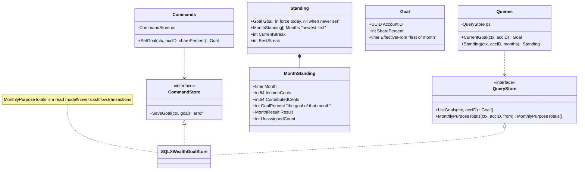
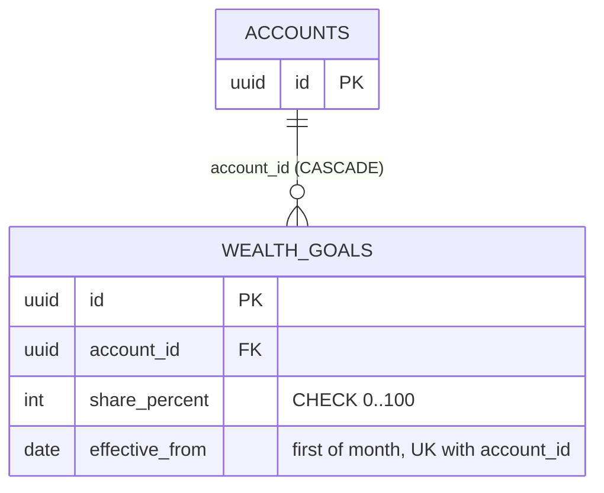

# [033] Monthly wealth goal

> **Feature IDs:** 033 · **Area:** Core (user-facing) · **Status:** live; routes registered in `cmd/ta11y/main.go`
>
> **Backend packages:** `internal/wealthgoal` · `transport/http/handlers/wealthgoal` · `internal/storage/sqlx_wealthgoal_store.go` · the `purpose` half lives in `internal/cashflow`
>
> **Related features:** [009]–[012] Cashflow (owns `purpose` and the transactions the standing counts) · [020] Web portal

## Overview

One goal per account: the share of the income you mark each month that should go towards
wealth. Two halves that only mean something together:

- **Purpose on a transaction** — a cashflow transaction counts as `income`, as `wealth`, or
  as nothing. It is a third classification beside the tag and the ignored flag, set per
  selection or per filter the way tagging and ignoring already are.
- **The monthly standing** — per calendar month: what you marked as income, what went
  towards wealth, the goal that applied in that month, whether it was met, and how many of
  its transactions you have not pointed at yet. Plus the run of met months.

## Domain model

Enums: `cashflow.Purpose` ∈ {`""`, `income`, `wealth`}; `MonthResult` ∈ {`met`, `missed`,
`in_progress`, `not_scored`}.

## Data model

Physical names: Postgres `wealthgoal.goals`; SQLite `wealth_goals`. The other half of the
schema is `cashflow.transactions.purpose` (`VARCHAR(16)`, default `''`, CHECK on the three
values) with an index on `(account_id, date, purpose)`.

## Processing rules

- **Direction.** Only incoming money can be `income` and only outgoing money can be
  `wealth`. Both sides of a transfer between your own accounts are in the ledger, so
  counting both would double the month. The rule is a predicate on the write, so a mixed
  selection updates the rows it can and the response reports `updated_count` against
  `matched_count`. Clearing a purpose carries no direction predicate.
- **Independent of tag and ignored.** A marked row counts towards the standing whatever its
  tag or ignored state — a transfer to a savings account is usually ignored for the cashflow
  totals and is exactly the money the goal is about. The unassigned count is the other way
  round: it leaves ignored rows out, because the ledger the standing links to hides them too.
- **A month is the calendar month** of the transaction date. There is no custom period.
- **A goal applies from the month it was set in.** Adjusting it writes (or replaces) the row
  for the current month; a month that has been scored keeps the goal it was judged by, so
  raising the bar never turns a met month into a missed one. A month before the account's
  first goal is returned `not_scored`.
- **Met** when `contributed × 100 ≥ income × goalPercent`, compared before rounding, so a
  month a fraction of a percent short is short. A month with no income marked is `missed`:
  the goal is a share of income.
- **The running month is never scored** (`in_progress`) and never counts towards the streak —
  an import that has not happened yet would break it. A finished month with unassigned
  transactions does count, with the result it has; the open count says the figure can still
  move.
- **Months without any transaction are absent** rather than scored as missed, and therefore
  do not break a streak. The running month is always present once a goal exists.
- **The streak** is the run of `met` months back from the newest finished one; the best
  streak is the longest such run in the window. The window is `months` (default 12, max 60).

## Endpoints

| Capability | Method + route | Key inputs | Success |
| --- | --- | --- | --- |
| Read the goal | `GET /wealth-goal` | — | 200 `{goal}` (`goal` null when never set) |
| Set the goal | `PUT /wealth-goal` | body: `share_percent` | 200 `{goal}` |
| Monthly standing | `GET /wealth-goal/standing` | query: `months` | 200 `{goal, months[], current_streak, best_streak}` |
| Mark a selection | `POST /cashflow/transactions/purpose/selection` | body: `purpose`, `ids[]` | 200 `{updated_count, matched_count, status}` |
| Mark a filter match | `POST /cashflow/transactions/purpose/filter` | body: `purpose`, `filters` | 200 `{updated_count, matched_count, status}` |
| Filter by purpose | `GET /cashflow/transactions?purpose=` | `income`, `wealth`, `none`, comma-separated | 200 |

**Error mapping:** a share outside 0..100, a missing `share_percent`, an unknown purpose, a
negative `months`, and the usual decode/filter validation → 400; store errors → 500. Marking
IDs that do not exist returns 200 with zero updated.

## Events

The wealth goal publishes and subscribes to **no** events. The standing is computed on read
from the cashflow rows, so a marked transaction is reflected on the next request without a
projection to keep in step.

## Code map

| Path | Responsibility |
| --- | --- |
| `migrations/{postgres,sqlite}/20261010090000_wealth_goal.sql` | The `purpose` column and the goals table |
| `internal/wealthgoal/goal.go` | `Goal`, validation, `StartOfMonth` |
| `internal/wealthgoal/commands.go` | `SetGoal`, `CommandStore` |
| `internal/wealthgoal/queries.go` | `CurrentGoal`, `Standing`, `QueryStore`, the month window |
| `internal/wealthgoal/standing.go` | Scoring and streak rules (`buildStanding`) |
| `internal/storage/sqlx_wealthgoal_store.go` | Goal upsert + the monthly purpose read model |
| `internal/cashflow/transaction.go` | `Purpose`, `ParsePurpose`, `SplitPurposes`, the direction rule |
| `internal/cashflow/commands.go` | `MarkPurposeByIDs` / `MarkPurposeByFilter` |
| `transport/http/handlers/wealthgoal/` | Goal read/write and standing handlers + DTOs |
| `transport/http/handlers/cashflow/transactions_purpose.go` | Purpose mutation handlers |
| `web/src/lib/services/wealthgoal.ts` | Frontend service + the mock branch that scores fixtures |
| `web/src/lib/components/organisms/wealth-goal-cards/` | The goal cards on Cashflow |

## Gaps / not implemented

- **One goal per account, nothing else.** Year-on-year growth, a return on a holding, paying
  off a house and budgets are out of scope, as are several goals side by side.
- **Nothing is recognised automatically.** Income and contributions are marked by hand;
  recurring-transaction detection (#16) and transfer detection (#23) are not wired to this.
- **Portfolio and Assets are not counted.** Only cashflow transactions feed the standing, so
  a deposit that exists only in Portfolio is invisible to the goal.
- **No history of adjustments beyond the month.** Adjusting the goal twice in one month
  replaces the row; only one share per account per month is kept.
- **The standing is computed per request.** There is no projection or cache; a very long
  history is bounded only by the `months` window.
